# 数据库实验报告（第六周）

班 级：3班   
姓 名：梁力航   
学 号：23336128

## 一、实验目的
- 熟悉SQL的有关视图的操作
- 能够使用SQL语句创建需要的视图，对视图进行查询和取消视图

## 二、实验内容
1) 定义选课信息和课程名称的视图 VIEWC
2) 定义学生姓名与选课信息的视图 VIEWS
3) 定义年级低于1998的学生的视图S1(SID, SNAME, GRADE)
4) 查询学生为"uxjof"的学生的选课信息
5) 查询选修课程"UML"的学生的编号和成绩
6) 向视图S1插入记录(60000001,Lily,2001)
7) 定义包括更新和插入约束的视图S1，尝试向视图插入记录(60000001,Lily,1997)，删除所有年级为1999的学生记录，讨论更新和插入约束带来的影响
8) 在视图VIEWS中将姓名为"uxjof"的学生的选课成绩都加上5分
9) 取消以上建立的所有视图

> 说明：所有操作均在 `USE School_Data;` 上下文下执行。

## 三、实验结果

### (1) 定义选课信息和课程名称的视图 VIEWC
```sql
DROP VIEW IF EXISTS VIEWC;
GO

CREATE VIEW VIEWC AS
SELECT CHOICES.*, COURSES.cname
FROM CHOICES
    JOIN COURSES ON CHOICES.cid = COURSES.cid;
GO

SELECT * FROM VIEWC;
```

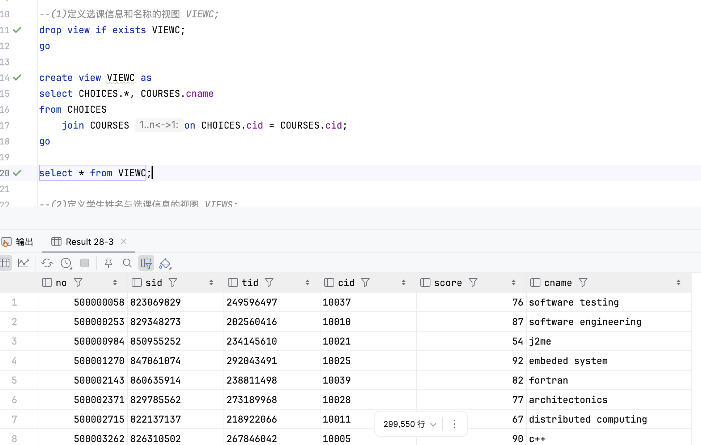

### (2) 定义学生姓名与选课信息的视图 VIEWS
```sql
DROP VIEW IF EXISTS VIEWS;
GO

CREATE VIEW VIEWS AS
SELECT STUDENTS.sname, CHOICES.*
FROM CHOICES
    JOIN STUDENTS ON CHOICES.sid = STUDENTS.sid;
GO

SELECT * FROM VIEWS;
```

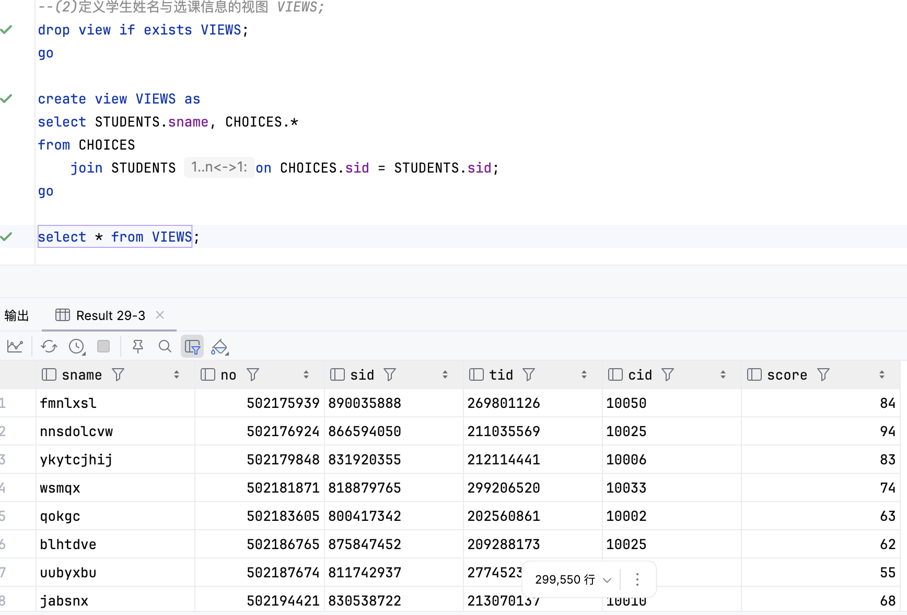

### (3) 定义年级低于1998的学生的视图S1(SID, SNAME, GRADE)
```sql
DROP VIEW IF EXISTS S1;
GO

CREATE VIEW S1 (SID, SNAME, GRADE) AS
SELECT sid, sname, grade
FROM STUDENTS
WHERE grade > 1998;
GO

SELECT * FROM S1;
```

.png)

### (4) 查询学生为"uxjof"的学生的选课信息
```sql
SELECT * FROM VIEWS WHERE sname = 'uxjof';
```

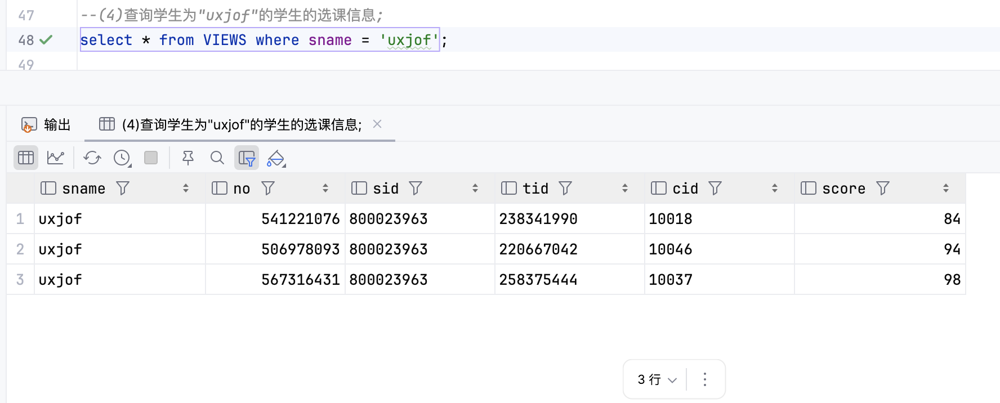

### (5) 查询选修课程"UML"的学生的编号和成绩
```sql
SELECT sid AS 学生编号, score AS 成绩 
FROM VIEWC 
WHERE cname = 'UML';
```

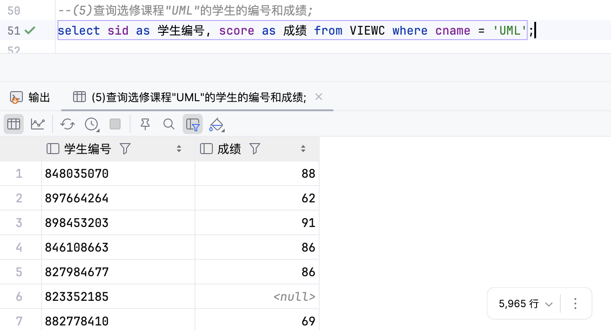

### (6) 向视图S1插入记录(60000001,Lily,2001)
```sql
-- 先清理可能存在的测试数据
DELETE FROM STUDENTS WHERE sid = '60000001';

-- 查看插入前的视图内容
SELECT * FROM S1 WHERE SID = '60000001';
```

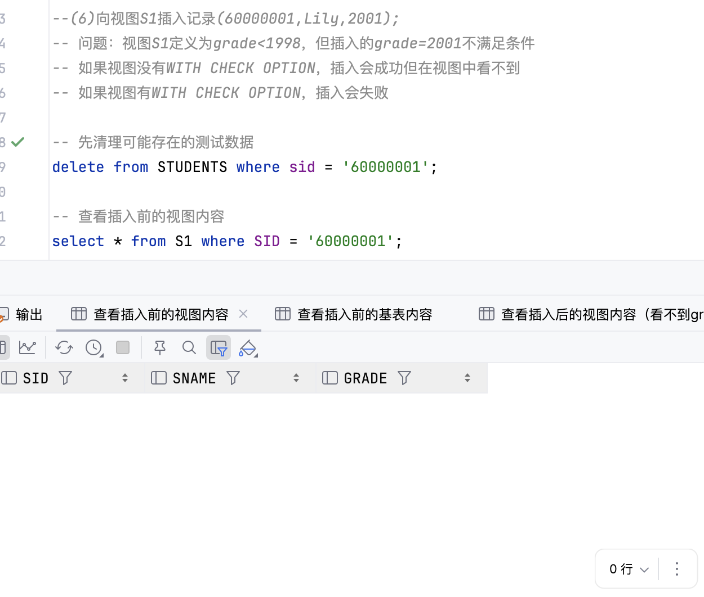

```sql
-- 查看插入前的基表内容
SELECT * FROM STUDENTS WHERE sid = '60000001';
```

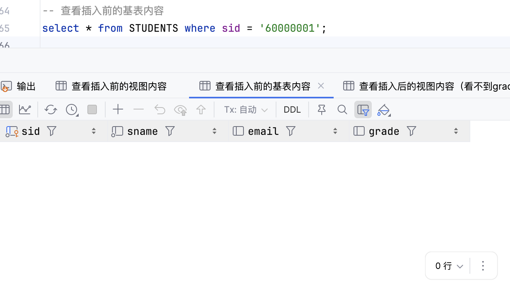

```sql
-- 执行插入操作
INSERT INTO S1 (SID, SNAME, GRADE) VALUES ('60000001', 'Lily', 2001);

-- 查看插入后的视图内容（可以看到grade=2001的记录，因为满足视图条件grade>1998）
SELECT * FROM S1 WHERE SID = '60000001';
```

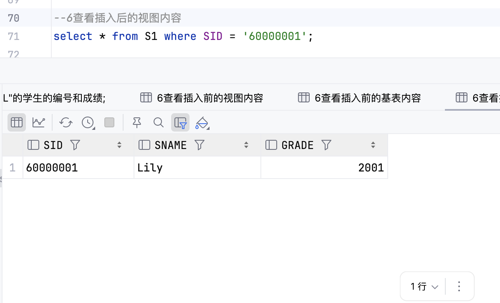

```sql
-- 查看插入后的基表内容（可以看到记录已插入）
SELECT * FROM STUDENTS WHERE sid = '60000001';
```


**说明**：视图S1定义为grade>1998，插入的grade=2001满足条件。由于视图没有WITH CHECK OPTION，插入成功并且在视图和基表中都可以看到该记录。

### (7) 定义包括更新和插入约束的视图S1
```sql
-- 先清理测试数据
DELETE FROM STUDENTS WHERE sid = '60000001';

-- 删除原来的S1视图
DROP VIEW IF EXISTS S1;
GO

-- 重新创建带WITH CHECK OPTION的视图
CREATE VIEW S1 (SID, SNAME, GRADE) AS
SELECT sid, sname, grade
FROM STUDENTS
WHERE grade > 1998
WITH CHECK OPTION;
GO
```

#### 操作前状态
```sql
-- 查看操作前-视图S1中sid=60000001的记录
SELECT * FROM S1 WHERE SID = '60000001';
```

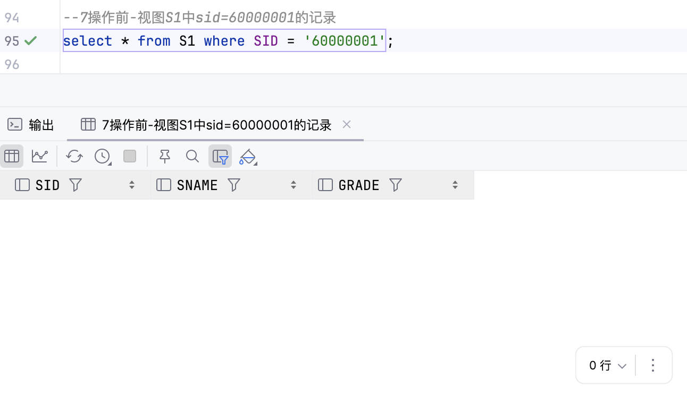

```sql
-- 查看操作前-基表中grade=1999的记录数
SELECT COUNT(*) AS 记录数 FROM STUDENTS WHERE grade = 1999;
```

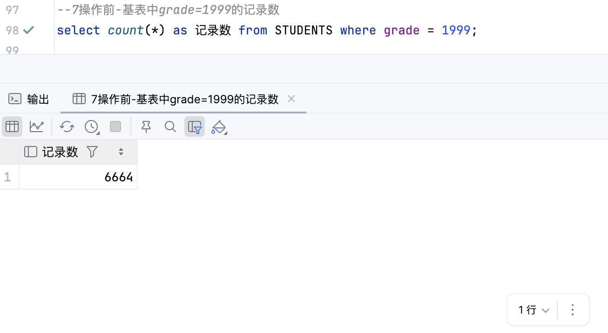

#### 插入操作
```sql
-- 尝试插入记录(60000001,Lily,1997) - 应该失败，因为1997不满足grade>1998
-- 由于有WITH CHECK OPTION，这个插入操作会被拒绝
INSERT INTO S1 (SID, SNAME, GRADE) VALUES ('60000001', 'Lily', 1997);
```

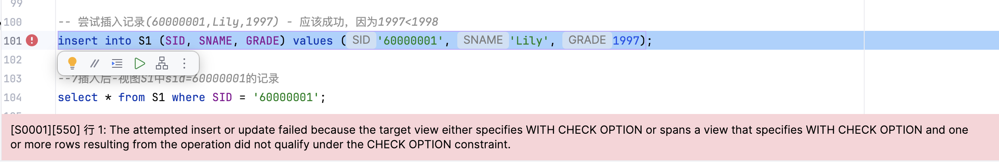

**说明**：由于WITH CHECK OPTION的约束，插入grade=1997的记录被拒绝，因为不满足视图定义的条件grade>1998。

```sql
-- 查看插入后-视图S1中sid=60000001的记录
SELECT * FROM S1 WHERE SID = '60000001';
```

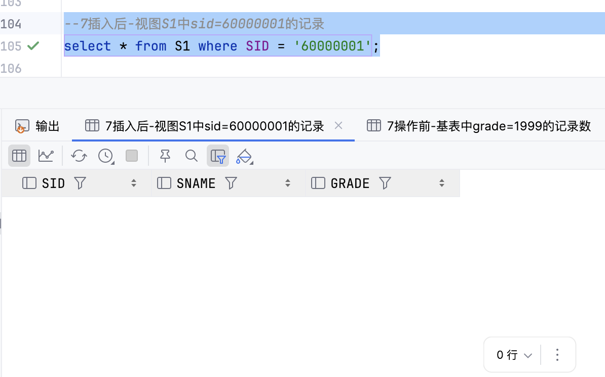

```sql
-- 查看插入后-基表中sid=60000001的记录
SELECT * FROM STUDENTS WHERE sid = '60000001';
```

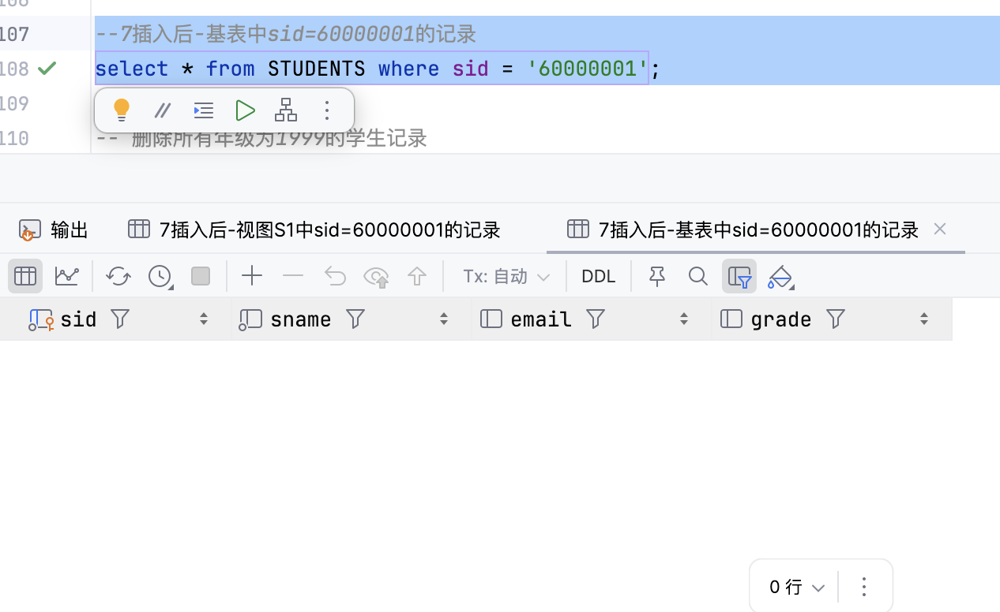

#### 删除操作

由于STUDENTS表与CHOICES表之间存在外键约束，直接通过视图删除学生记录会失败。需要先删除CHOICES表中的相关选课记录，然后才能删除学生记录。

```sql
-- 先删除CHOICES表中grade=1999学生的选课记录
DELETE FROM CHOICES
WHERE sid IN (
    SELECT sid
    FROM STUDENTS
    WHERE STUDENTS.grade = 1999
);

-- 然后删除STUDENTS表中grade=1999的学生记录
DELETE FROM S1 WHERE GRADE = 1999;
```

```sql
-- 查看删除后-视图中grade=1999的记录数
SELECT COUNT(*) AS 记录数 FROM S1 WHERE grade = 1999;
```

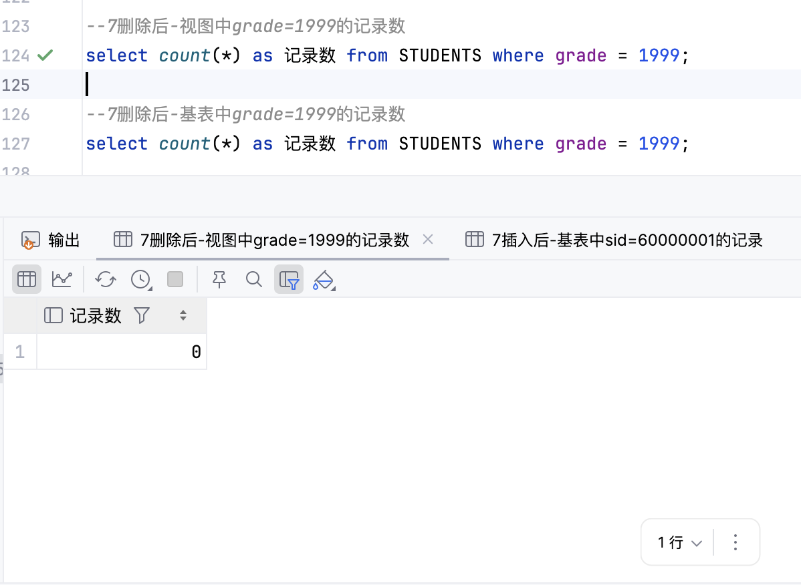

```sql
-- 查看删除后-基表中grade=1999的记录数
SELECT COUNT(*) AS 记录数 FROM STUDENTS WHERE grade = 1999;
```

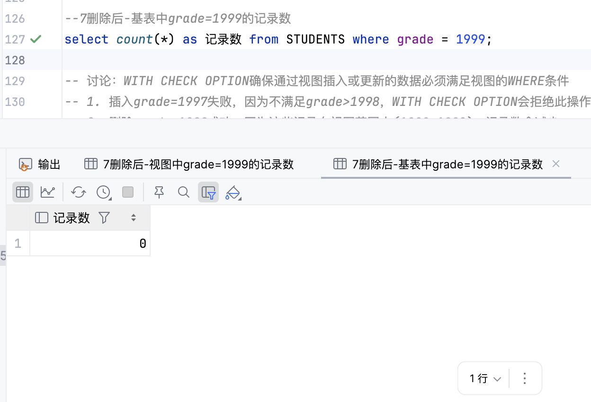

**讨论**：
- WITH CHECK OPTION确保通过视图插入或更新的数据必须满足视图的WHERE条件
- 插入grade=1997失败，因为不满足grade>1998，WITH CHECK OPTION会拒绝此操作
- 删除grade=1999的记录时，由于外键约束，需要先删除CHOICES表中的相关记录，然后才能通过视图删除STUDENTS表中的记录
- 删除操作成功后，视图和基表中grade=1999的记录数都变为0

### (8) 在视图VIEWS中将姓名为"uxjof"的学生的选课成绩都加上5分
```sql
-- 先备份原始成绩到临时表
IF OBJECT_ID('tempdb..#uxjof_backup') IS NOT NULL
    DROP TABLE #uxjof_backup;

SELECT C.no, C.sid, C.tid, C.cid, C.score AS original_score
INTO #uxjof_backup
FROM CHOICES C
JOIN STUDENTS S ON C.sid = S.sid
WHERE S.sname = 'uxjof';
```

#### 更新前
```sql
SELECT * FROM VIEWS WHERE sname = 'uxjof';
```

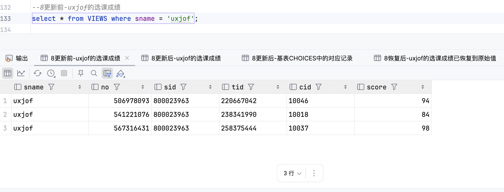

#### 执行更新
```sql
UPDATE VIEWS SET score = score + 5 WHERE sname = 'uxjof';

SELECT * FROM VIEWS WHERE sname = 'uxjof';
```

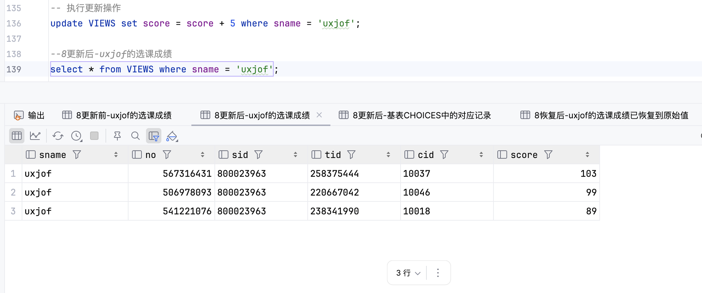

#### 验证基表
```sql
SELECT C.*
FROM CHOICES C
JOIN STUDENTS S ON C.sid = S.sid
WHERE S.sname = 'uxjof';
```

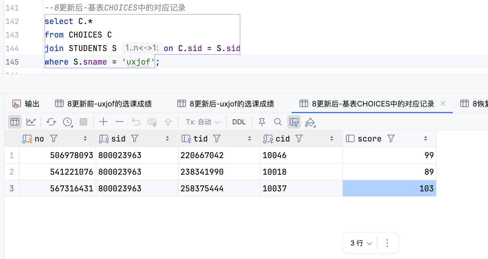

#### 恢复原始数据
```sql
-- 恢复原始成绩（避免反复运行导致成绩越来越高）
UPDATE C
SET C.score = B.original_score
FROM CHOICES C
JOIN #uxjof_backup B ON C.no = B.no;

SELECT * FROM VIEWS WHERE sname = 'uxjof';
```

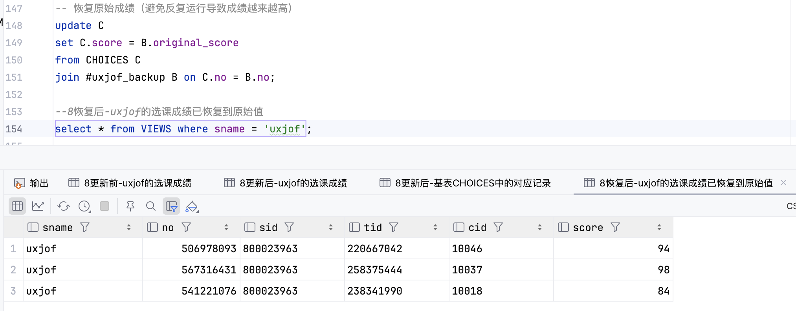

**说明**：通过视图更新数据会同时更新基表。为避免反复运行脚本导致成绩累加，使用临时表备份并在演示后恢复原始数据。

### (9) 取消以上建立的所有视图
```sql
-- 查看删除前-当前数据库中的视图
SELECT TABLE_NAME AS 视图名称
FROM INFORMATION_SCHEMA.VIEWS
WHERE TABLE_NAME IN ('VIEWC', 'VIEWS', 'S1');
```

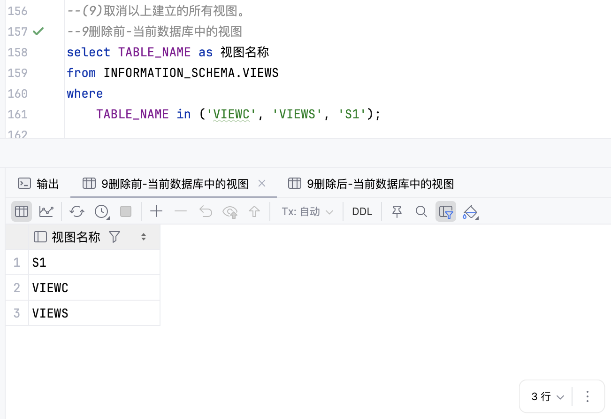

```sql
-- 删除视图
DROP VIEW IF EXISTS VIEWC;
DROP VIEW IF EXISTS VIEWS;
DROP VIEW IF EXISTS S1;

-- 查看删除后-当前数据库中的视图
SELECT TABLE_NAME AS 视图名称
FROM INFORMATION_SCHEMA.VIEWS
WHERE TABLE_NAME IN ('VIEWC', 'VIEWS', 'S1');
```

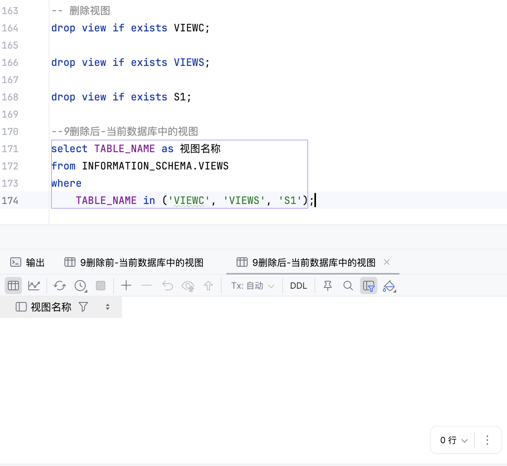

## 四、问题&总结

通过本次实验，我对视图的概念和使用有了更深入的理解。视图本质上是一个虚拟表，它不存储实际数据，只保存查询定义。当我们查询视图时，数据库会将视图的查询转换为对基表的查询。这种机制既可以简化复杂的查询操作，又能提供一定的数据安全性和逻辑独立性。

在第6题和第7题的对比中，我发现WITH CHECK OPTION这个约束的作用非常明显。视图S1定义为年级低于1998（即grade>1998，因为年份越大年级越低）。在第6题中，视图没有WITH CHECK OPTION约束，插入grade=2001的记录成功了，因为2001>1998满足视图条件，所以在视图和基表中都能看到。但在第7题中，加上WITH CHECK OPTION后，尝试插入grade=1997的记录就会失败，因为1997不满足grade>1998的条件，约束会直接拒绝这个操作。这个特性在实际应用中很有用，可以确保通过视图操作的数据都符合预期的条件。

在删除操作中遇到了一个实际问题。虽然grade=1999满足视图条件（1999>1998），理论上可以通过视图删除，但由于STUDENTS表与CHOICES表之间存在外键约束，直接删除学生记录会违反参照完整性。这让我意识到，通过视图进行删除操作时，不仅要考虑视图本身的条件，还要考虑基表之间的约束关系。解决方法是先删除CHOICES表中该学生的选课记录，然后再通过视图删除STUDENTS表中的学生记录。这个过程体现了数据库完整性约束的重要性。

关于视图的更新，我发现并不是所有视图都可以随意更新。像S1这种简单的行列子集视图是可以更新的，但基于多表连接的视图（如VIEWC、VIEWS）更新起来就有限制了，通常只能更新其中一个基表的数据。如果视图包含聚合函数、GROUP BY、DISTINCT或UNION这些复杂操作，那就完全不能更新了。第8题中我通过VIEWS视图更新了学生成绩，发现基表CHOICES也同步更新了，这说明对视图的修改会直接作用到基表上。

在编写SQL语句时遇到了一些语法问题。SQL Server要求CREATE VIEW必须是批处理中的第一条语句，所以需要用GO语句来分隔不同的批处理。一开始我没注意这点，导致报错。后来在每个DROP VIEW和CREATE VIEW之间加上GO就解决了。另外使用DROP VIEW IF EXISTS可以避免重复创建视图时的错误，这样脚本可以反复运行而不会出问题。

第9题删除视图的操作让我意识到，删除视图只是删除了查询定义，并不会影响基表的数据。但如果有其他视图是基于被删除的视图创建的，那些视图就会失效，需要手动删除。通过查询INFORMATION_SCHEMA.VIEWS系统视图，可以方便地查看数据库中存在哪些视图。

在实践过程中，我还总结了一些小技巧。比如为了避免测试数据污染数据库，在插入测试记录前先清理可能存在的旧记录。对于会修改数据的操作，可以用临时表先备份原始数据，演示完成后再恢复，这样就不会因为反复运行脚本而导致数据异常（比如第8题中成绩不断累加的问题）。
