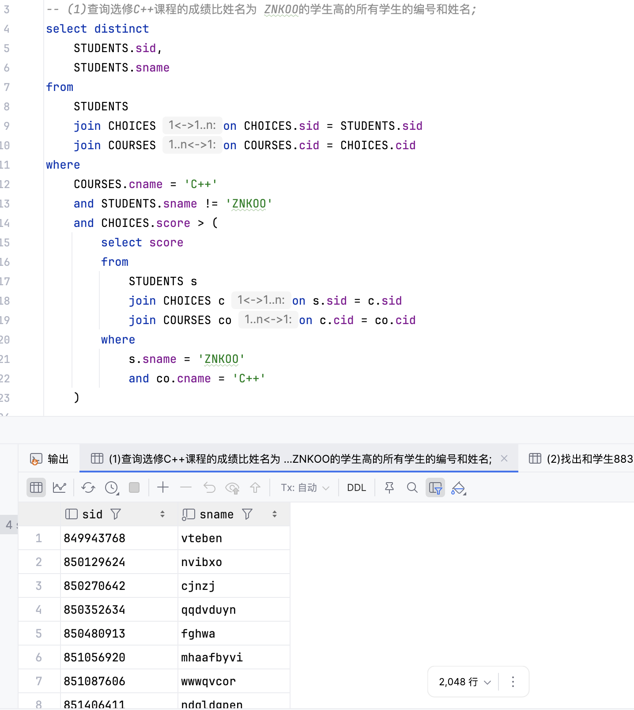
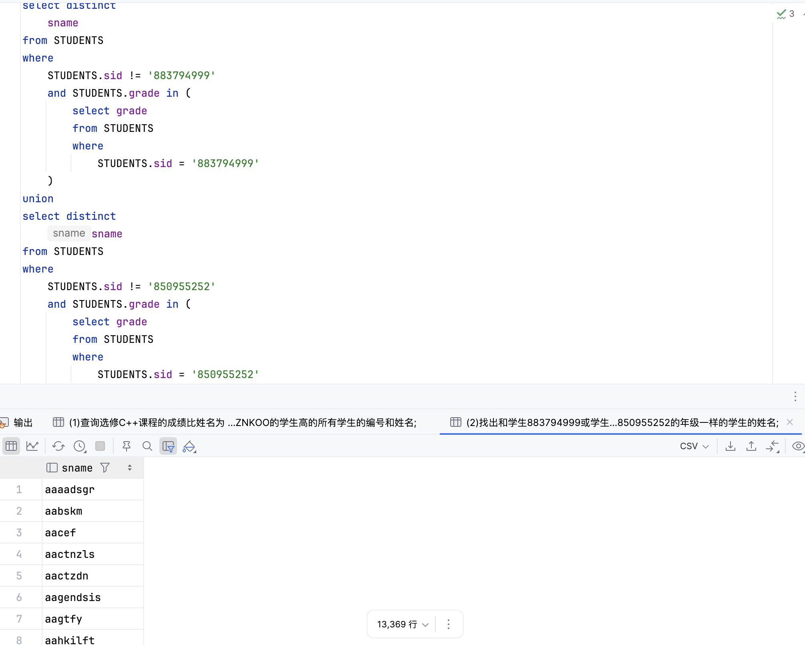
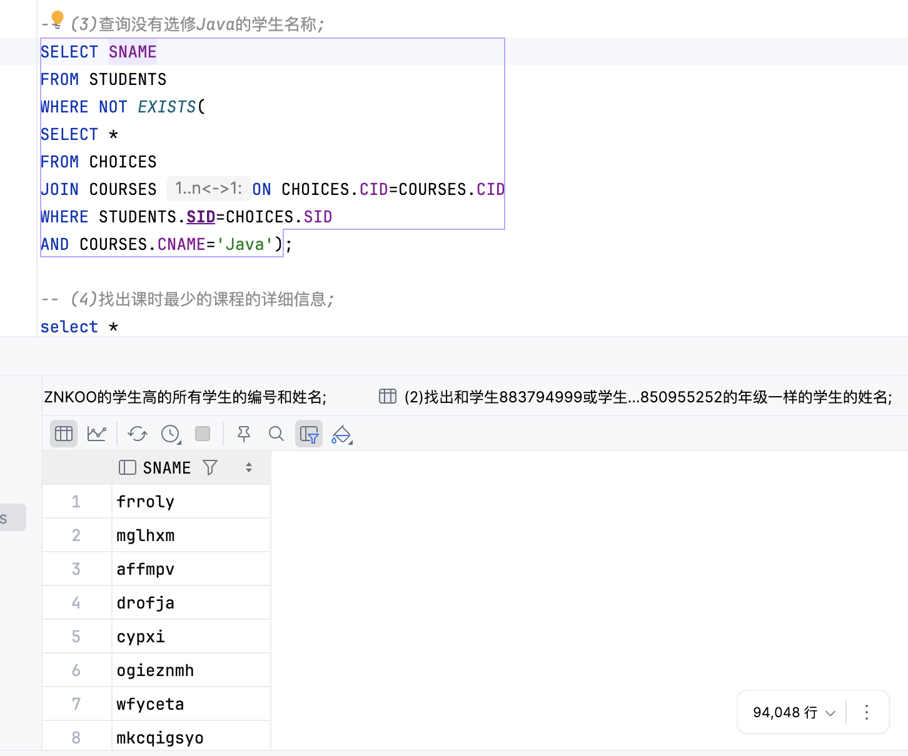
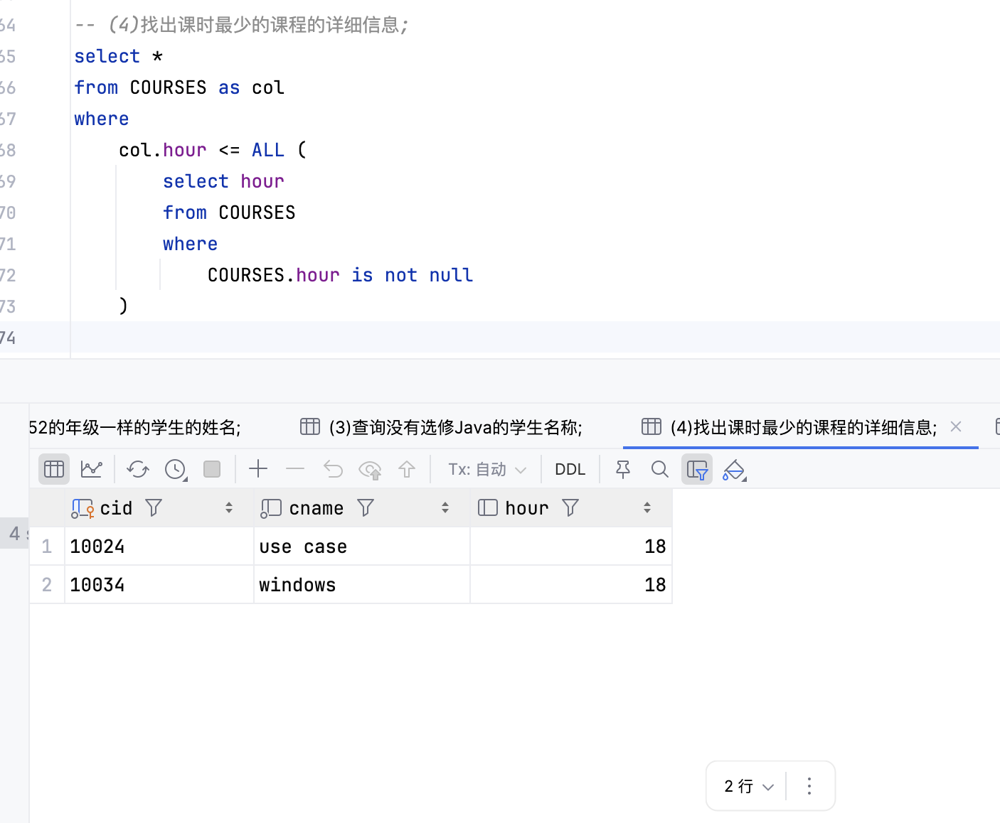
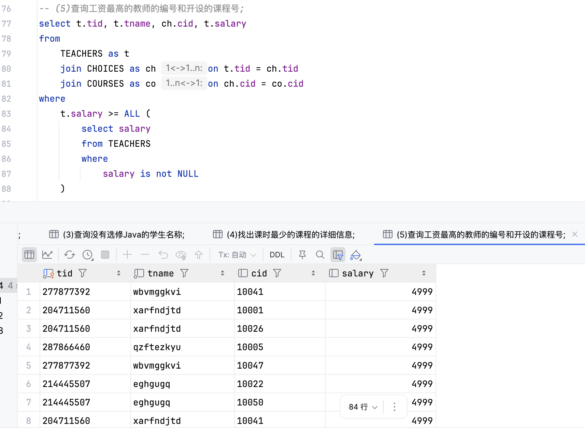
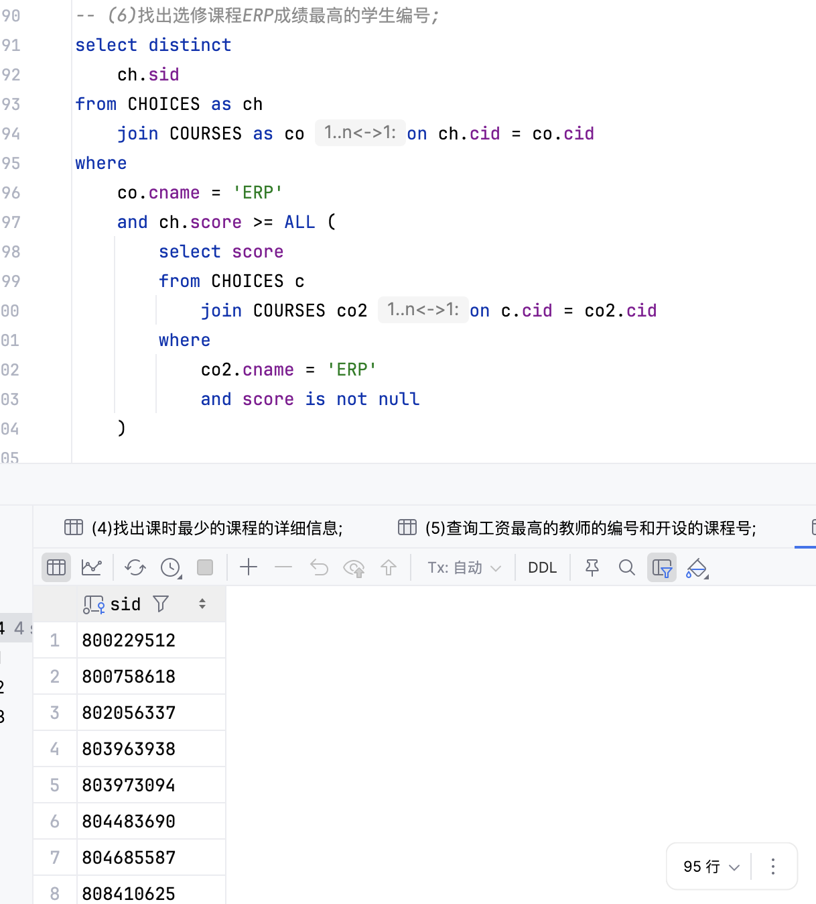
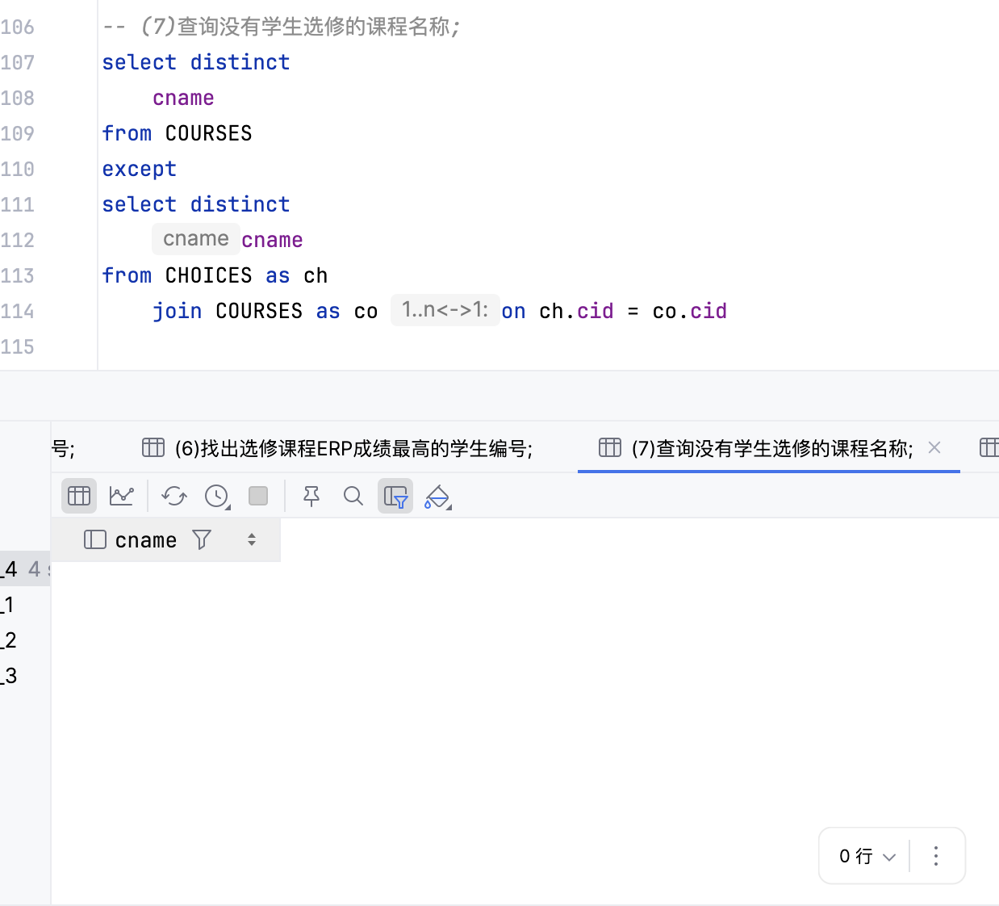
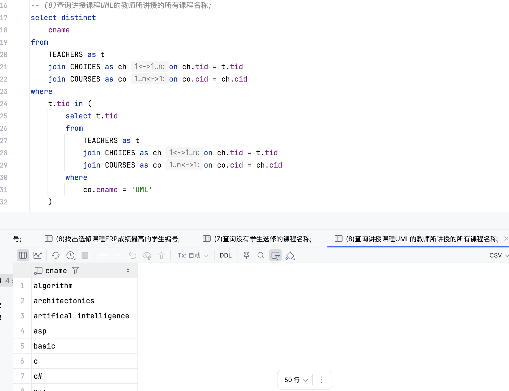
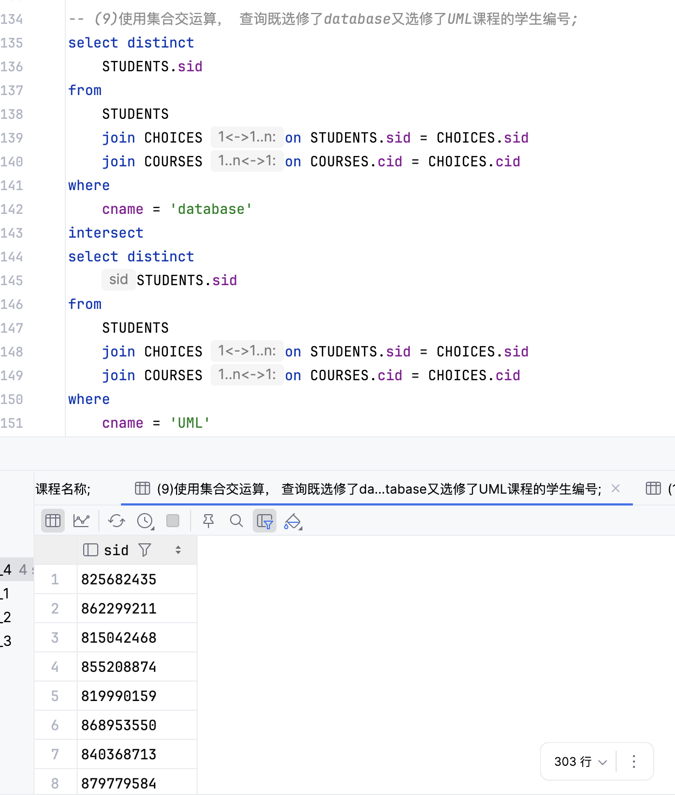
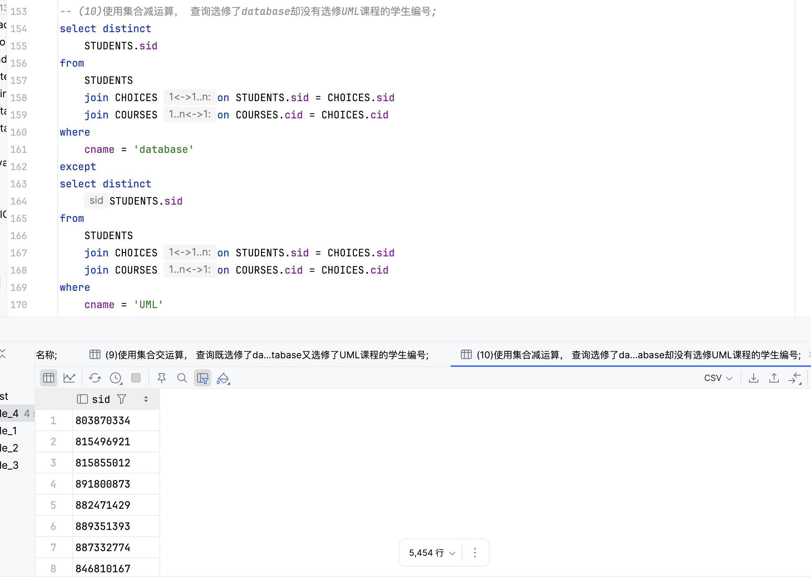

# 数据库实验报告（第四周）

班 级：3班   
姓 名：梁力航   
学 号：23336128

## 一、实验目的
- 熟悉SQL的数据查询语言
- 能够使用SQL语句对数据库进行嵌套查询、集合运算

## 二、实验内容
1) 查询选修C++课程的成绩比姓名为 ZNKOO的学生高的所有学生的编号和姓名
2) 找出和学生883794999或学生850955252的年级一样的学生的姓名
3) 查询没有选修Java的学生名称
4) 找出课时最少的课程的详细信息
5) 查询工资最高的教师的编号和开设的课程号
6) 找出选修课程ERP成绩最高的学生编号
7) 查询没有学生选修的课程名称
8) 查询讲授课程UML的教师所讲授的所有课程名称
9) 使用集合交运算，查询既选修了database又选修了UML课程的学生编号
10) 使用集合减运算，查询选修了database却没有选修UML课程的学生编号

> 说明：所有查询均在 `USE School_Data;` 上下文下执行。

## 三、实验结果

### (1) 查询选修C++课程的成绩比姓名为 ZNKOO的学生高的所有学生的编号和姓名
```sql
SELECT DISTINCT
    STUDENTS.sid AS 学生编号,
    STUDENTS.sname AS 学生姓名
FROM
    STUDENTS
    JOIN CHOICES ON CHOICES.sid = STUDENTS.sid
    JOIN COURSES ON COURSES.cid = CHOICES.cid
WHERE
    COURSES.cname = 'C++'
    AND STUDENTS.sname != 'ZNKOO'
    AND CHOICES.score > (
        SELECT score
        FROM
            STUDENTS s
            JOIN CHOICES c ON s.sid = c.sid
            JOIN COURSES co ON c.cid = co.cid
        WHERE
            s.sname = 'ZNKOO'
            AND co.cname = 'C++'
    );
```



### (2) 找出和学生883794999或学生850955252的年级一样的学生的姓名

```sql
SELECT DISTINCT
    sname AS 学生姓名
FROM STUDENTS
WHERE
    STUDENTS.sid != '883794999'
    AND STUDENTS.grade IN (
        SELECT grade
        FROM STUDENTS
        WHERE
            STUDENTS.sid = '883794999'
    )
UNION
SELECT DISTINCT
    sname AS 学生姓名
FROM STUDENTS
WHERE
    STUDENTS.sid != '850955252'
    AND STUDENTS.grade IN (
        SELECT grade
        FROM STUDENTS
        WHERE
            STUDENTS.sid = '850955252'
    );
```

>这里我将这两个学生本人排除在外，如果加上，则行数应为13369+2=13371



### (3) 查询没有选修Java的学生名称
```sql
SELECT SNAME
FROM STUDENTS
WHERE NOT EXISTS(
SELECT *
FROM CHOICES
JOIN COURSES ON CHOICES.CID=COURSES.CID
WHERE STUDENTS.SID=CHOICES.SID
AND COURSES.CNAME='Java')
```



### (4) 找出课时最少的课程的详细信息
```sql
SELECT 
    col.cid AS 课程编号,
    col.cname AS 课程名称,
    col.hour AS 课时
FROM COURSES AS col
WHERE
    col.hour <= ALL (
        SELECT hour
        FROM COURSES
        WHERE
            COURSES.hour IS NOT NULL
    );
```



### (5) 查询工资最高的教师的编号和开设的课程号
```sql
SELECT 
    t.tid AS 教师编号, 
    t.tname AS 教师姓名, 
    ch.cid AS 课程编号, 
    t.salary AS 工资
FROM
    TEACHERS AS t
    JOIN CHOICES AS ch ON t.tid = ch.tid
    JOIN COURSES AS co ON ch.cid = co.cid
WHERE
    t.salary >= ALL (
        SELECT salary
        FROM TEACHERS
        WHERE
            salary IS NOT NULL
    );
```



### (6) 找出选修课程ERP成绩最高的学生编号
```sql
SELECT DISTINCT
    ch.sid AS 学生编号
FROM CHOICES AS ch
    JOIN COURSES AS co ON ch.cid = co.cid
WHERE
    co.cname = 'ERP'
    AND ch.score >= ALL (
        SELECT score
        FROM CHOICES c
            JOIN COURSES co2 ON c.cid = co2.cid
        WHERE
            co2.cname = 'ERP'
            AND score IS NOT NULL
    );
```



### (7) 查询没有学生选修的课程名称
```sql
SELECT DISTINCT
    cname AS 课程名称
FROM COURSES
EXCEPT
SELECT DISTINCT
    cname AS 课程名称
FROM CHOICES AS ch
    JOIN COURSES AS co ON ch.cid = co.cid;
```



### (8) 查询讲授课程UML的教师所讲授的所有课程名称
```sql
SELECT DISTINCT
    cname AS 课程名称
FROM
    TEACHERS AS t
    JOIN CHOICES AS ch ON ch.tid = t.tid
    JOIN COURSES AS co ON co.cid = ch.cid
WHERE
    t.tid IN (
        SELECT t.tid
        FROM
            TEACHERS AS t
            JOIN CHOICES AS ch ON ch.tid = t.tid
            JOIN COURSES AS co ON co.cid = ch.cid
        WHERE
            co.cname = 'UML'
    );
```



### (9) 使用集合交运算，查询既选修了database又选修了UML课程的学生编号
```sql
SELECT DISTINCT
    STUDENTS.sid AS 学生编号
FROM
    STUDENTS
    JOIN CHOICES ON STUDENTS.sid = CHOICES.sid
    JOIN COURSES ON COURSES.cid = CHOICES.cid
WHERE
    cname = 'database'
INTERSECT
SELECT DISTINCT
    STUDENTS.sid AS 学生编号
FROM
    STUDENTS
    JOIN CHOICES ON STUDENTS.sid = CHOICES.sid
    JOIN COURSES ON COURSES.cid = CHOICES.cid
WHERE
    cname = 'UML';
```



### (10) 使用集合减运算，查询选修了database却没有选修UML课程的学生编号
```sql
SELECT DISTINCT
    STUDENTS.sid AS 学生编号
FROM
    STUDENTS
    JOIN CHOICES ON STUDENTS.sid = CHOICES.sid
    JOIN COURSES ON COURSES.cid = CHOICES.cid
WHERE
    cname = 'database'
EXCEPT
SELECT DISTINCT
    STUDENTS.sid AS 学生编号
FROM
    STUDENTS
    JOIN CHOICES ON STUDENTS.sid = CHOICES.sid
    JOIN COURSES ON COURSES.cid = CHOICES.cid
WHERE
    cname = 'UML';
```



## 四、问题&总结
- 第(1)题：嵌套查询的关键在于子查询要返回单值。这里用子查询获取ZNKOO学生的C++成绩，然后在外层查询中比较其他学生的成绩。注意要用sname而不是sid来匹配学生姓名。
- 第(3)题：使用EXCEPT集合减运算时，第一个查询应该是所有学生，而不是只查选过课的学生，否则会漏掉没选任何课的学生。
- 第(6)题：题目要求查询ERP课程成绩最高的学生，需要在子查询中也限定ERP课程，不能查所有课程的最高分。
- 第(8)题：使用IN谓词配合子查询，先找出讲授UML课程的教师编号，再查询这些教师讲授的所有课程。这是典型的相关子查询应用。
- 集合运算：UNION（并）、INTERSECT（交）、EXCEPT（减）三种集合运算要求参与运算的两个查询结果必须有相同的列数和兼容的数据类型。使用时要注意列的对应关系。
- ALL谓词：在第(4)(5)(6)题中使用了 `>= ALL` 或 `<= ALL` 来查找最大值或最小值，这种方式比使用MAX/MIN函数更灵活，可以返回完整的记录信息。
