# 数据库实验报告（第七周）

班 级：3班   
姓 名：梁力航   
学 号：23336128

## 一、实验目的
- 熟悉SQL的数据控制操作
- 能够使用SQL语句对用户进行授予和收回权限

## 二、实验内容
1) 使用GRANT语句对用户授权，对单个用户和多个用户授权，或使用保留字PUBLIC对所有用户授权。对不同的操作对象包括数据库、视图、基本表等进行不同权限的授权。
2) 使用WITH GRANT OPTION子句授予用户传播该权限的权利。
3) 在授权时发生循环授权，考察DBS能否发现这个错误。如果不能，结合取消权限操作，查看DBS对循环授权的控制。
4) 使用REVOKE子句收回授权，查看取消授权的级联反应。

> 说明：本实验在SQL Server环境下进行，使用School_Data数据库，创建了三个测试用户USER1、USER2、USER3。

## 三、实验结果

### 环境准备

#### 数据库用户架构
本实验涉及三个用户（USER1、USER2、USER3）和多个数据库对象（表和视图）。下图展示了实验中使用的数据库用户架构：

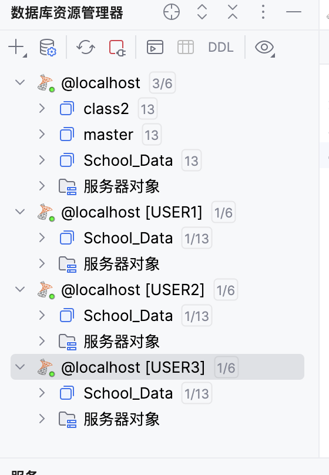

#### 环境重置
首先重置实验环境，删除已存在的用户和登录名，然后重新创建：

```sql
-- 删除已存在的数据库用户
USE School_Data;
GO

IF EXISTS (SELECT * FROM sys.database_principals WHERE name = 'USER1') DROP USER USER1;
IF EXISTS (SELECT * FROM sys.database_principals WHERE name = 'USER2') DROP USER USER2;
IF EXISTS (SELECT * FROM sys.database_principals WHERE name = 'USER3') DROP USER USER3;
GO

-- 删除已存在的登录名
USE master;
GO

IF EXISTS (SELECT * FROM sys.server_principals WHERE name = 'USER1') DROP LOGIN USER1;
IF EXISTS (SELECT * FROM sys.server_principals WHERE name = 'USER2') DROP LOGIN USER2;
IF EXISTS (SELECT * FROM sys.server_principals WHERE name = 'USER3') DROP LOGIN USER3;
GO

-- 重新创建登录名
CREATE LOGIN USER1 WITH PASSWORD = 'YourStrong!Passw0rd123', DEFAULT_DATABASE = School_Data;
CREATE LOGIN USER2 WITH PASSWORD = 'YourStrong!Passw0rd123', DEFAULT_DATABASE = School_Data;
CREATE LOGIN USER3 WITH PASSWORD = 'YourStrong!Passw0rd123', DEFAULT_DATABASE = School_Data;
GO

-- 重新创建数据库用户（无任何权限）
USE School_Data;
GO

CREATE USER USER1 FOR LOGIN USER1 WITH DEFAULT_SCHEMA = dbo;
CREATE USER USER2 FOR LOGIN USER2 WITH DEFAULT_SCHEMA = dbo;
CREATE USER USER3 FOR LOGIN USER3 WITH DEFAULT_SCHEMA = dbo;
GO
```

### (1) 授予所有用户对表STUDENTS的查询权限

#### 初始状态验证
在授权前，USER1尝试查询STUDENTS表会失败：

```sql
-- USER1执行
USE School_Data;
SELECT * FROM STUDENTS;
```

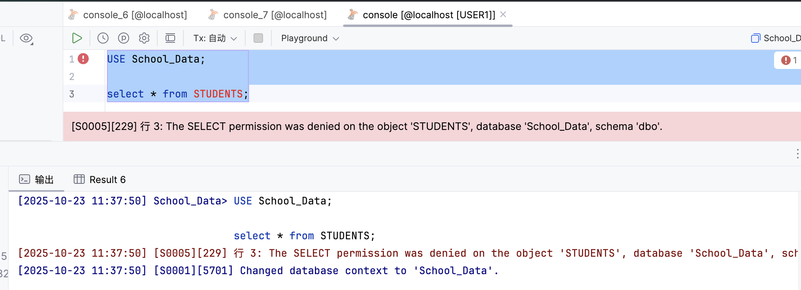

#### 授权操作
使用PUBLIC关键字对所有用户授权：

```sql
-- 管理员执行
GRANT SELECT ON STUDENTS TO PUBLIC;
```

#### 验证权限
```sql
SELECT dp.name AS 用户名, permission_name AS 权限类型, state_desc AS 状态
FROM sys.database_permissions p
JOIN sys.database_principals dp ON p.grantee_principal_id = dp.principal_id
WHERE p.major_id = OBJECT_ID('STUDENTS')
AND dp.name IN ('USER1', 'USER2', 'USER3', 'public');
```

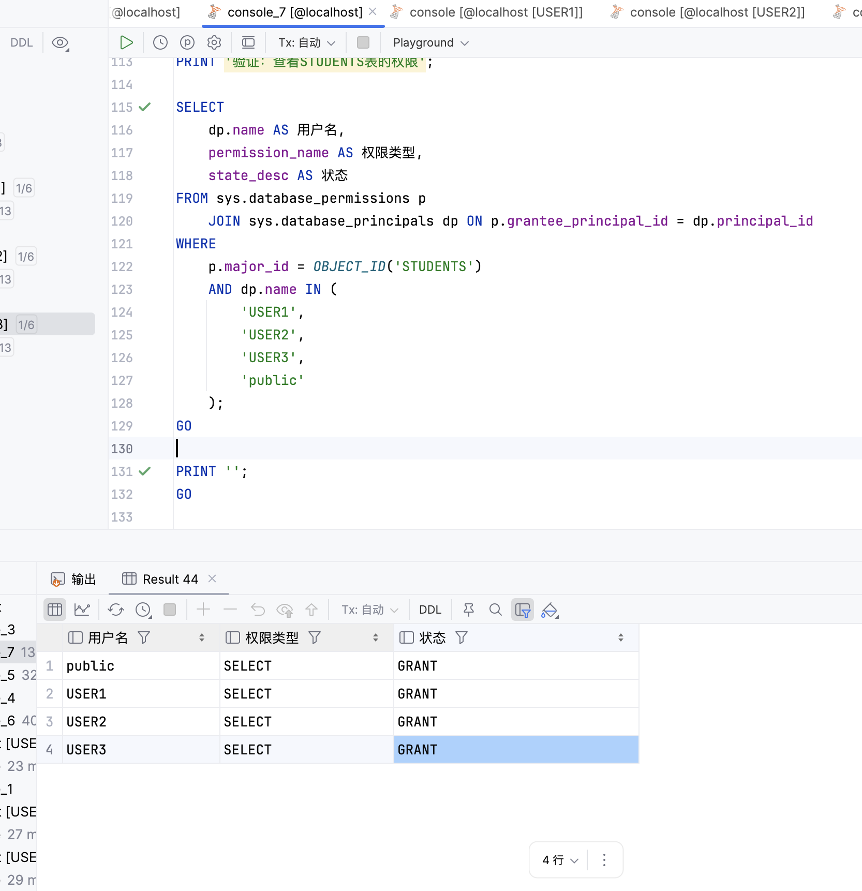

#### 授权后测试
```sql
-- USER1执行
SELECT * FROM STUDENTS;
```

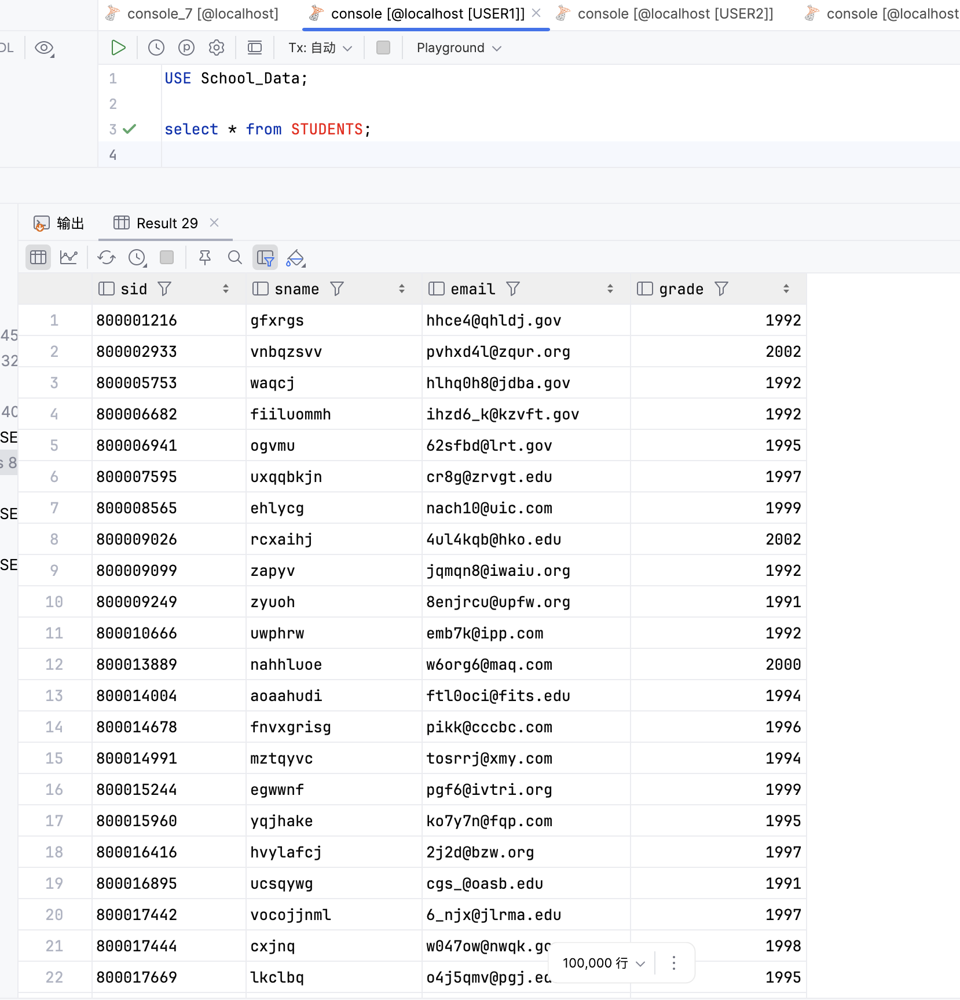

**说明**：使用PUBLIC关键字可以一次性授予所有用户权限，包括当前和未来创建的用户。

### (2) 授予所有用户对表COURSES的查询和更新权限

```sql
-- 管理员执行
GRANT SELECT ON COURSES TO PUBLIC;
GRANT UPDATE ON COURSES TO PUBLIC;
```

#### 验证权限
```sql
SELECT dp.name AS 用户名, permission_name AS 权限类型, state_desc AS 状态
FROM sys.database_permissions p
JOIN sys.database_principals dp ON p.grantee_principal_id = dp.principal_id
WHERE p.major_id = OBJECT_ID('COURSES')
AND dp.name IN ('USER1', 'USER2', 'USER3', 'public');
```

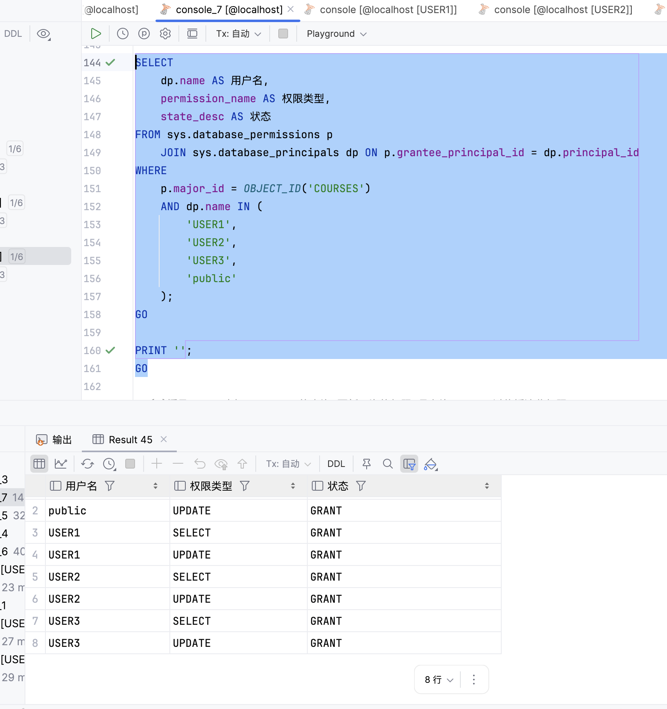

**说明**：可以对同一对象授予多种权限，这里授予了SELECT和UPDATE两种权限。

### (3) 授予USER1对表TEACHERS的查询、更新工资的权限，且允许传播

由于题目要求只授予对工资字段的权限，这里创建视图TS来实现列级权限控制：

```sql
-- 管理员执行
CREATE VIEW TS AS SELECT salary FROM TEACHERS;
GRANT SELECT ON TS TO USER1 WITH GRANT OPTION;
GRANT UPDATE ON TS TO USER1 WITH GRANT OPTION;
```

#### 验证权限
```sql
SELECT dp.name AS 用户名, permission_name AS 权限类型, state_desc AS 状态,
       CASE WHEN p.state = 'W' THEN '是' ELSE '否' END AS 可传播
FROM sys.database_permissions p
JOIN sys.database_principals dp ON p.grantee_principal_id = dp.principal_id
WHERE p.major_id = OBJECT_ID('TS')
AND dp.name = 'USER1';
```

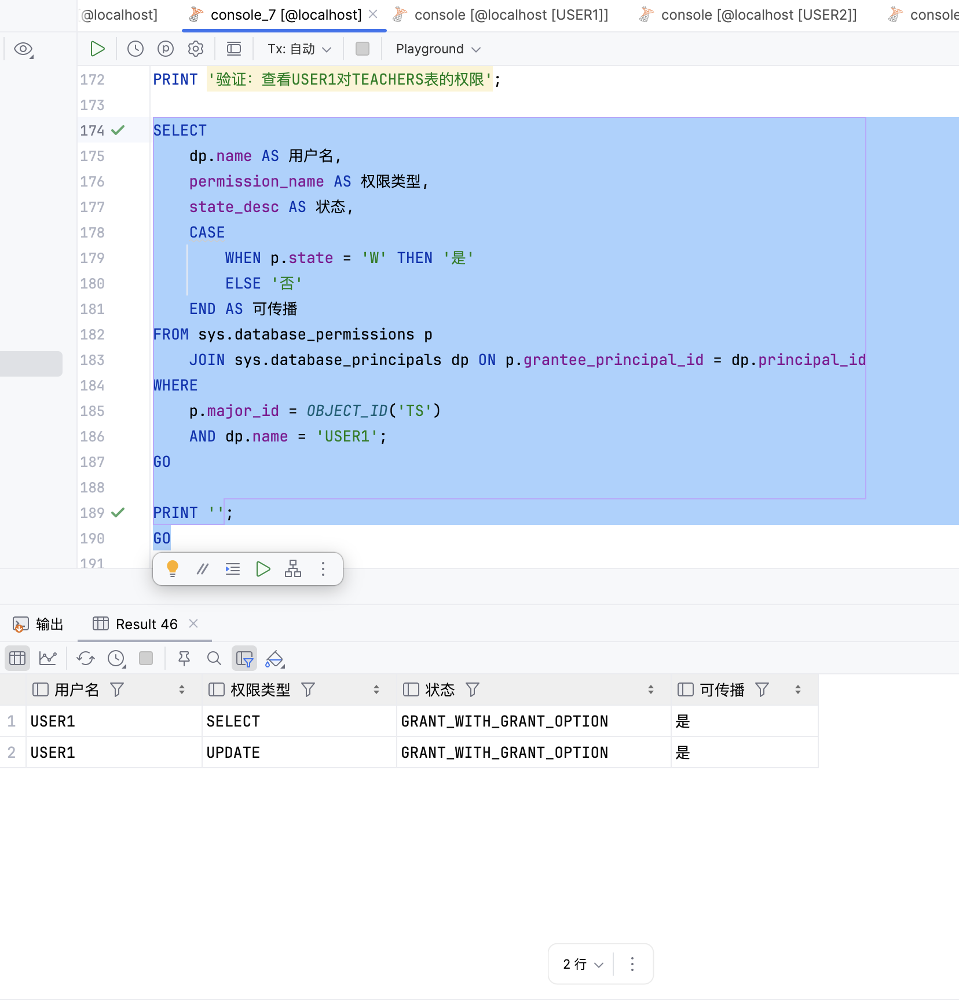

#### USER1测试权限
```sql
-- USER1执行
USE School_Data;
SELECT * FROM TEACHERS;        -- 失败，无权限
SELECT salary FROM TEACHERS;   -- 失败，无权限
SELECT salary FROM TS;         -- 成功
```

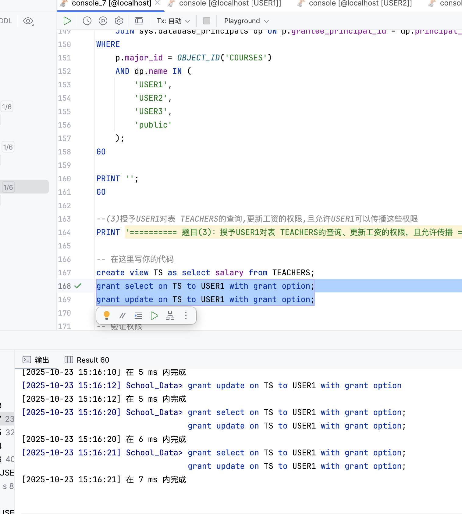

**说明**：
- WITH GRANT OPTION允许USER1将该权限传播给其他用户
- 通过视图实现了列级权限控制，USER1只能访问salary字段
- state='W'表示该权限带有传播权（WITH GRANT OPTION）

### (4) 授予USER2对表CHOICES的查询、更新成绩的权限

同样使用视图实现列级权限控制：

```sql
-- 管理员执行
CREATE VIEW CS AS SELECT score FROM CHOICES;
GRANT SELECT ON CS TO USER2;
GRANT UPDATE ON CS TO USER2;
```

#### 验证权限
```sql
SELECT dp.name AS 用户名, permission_name AS 权限类型, state_desc AS 状态
FROM sys.database_permissions p
JOIN sys.database_principals dp ON p.grantee_principal_id = dp.principal_id
WHERE p.major_id = OBJECT_ID('CS')
AND dp.name = 'USER2';
```

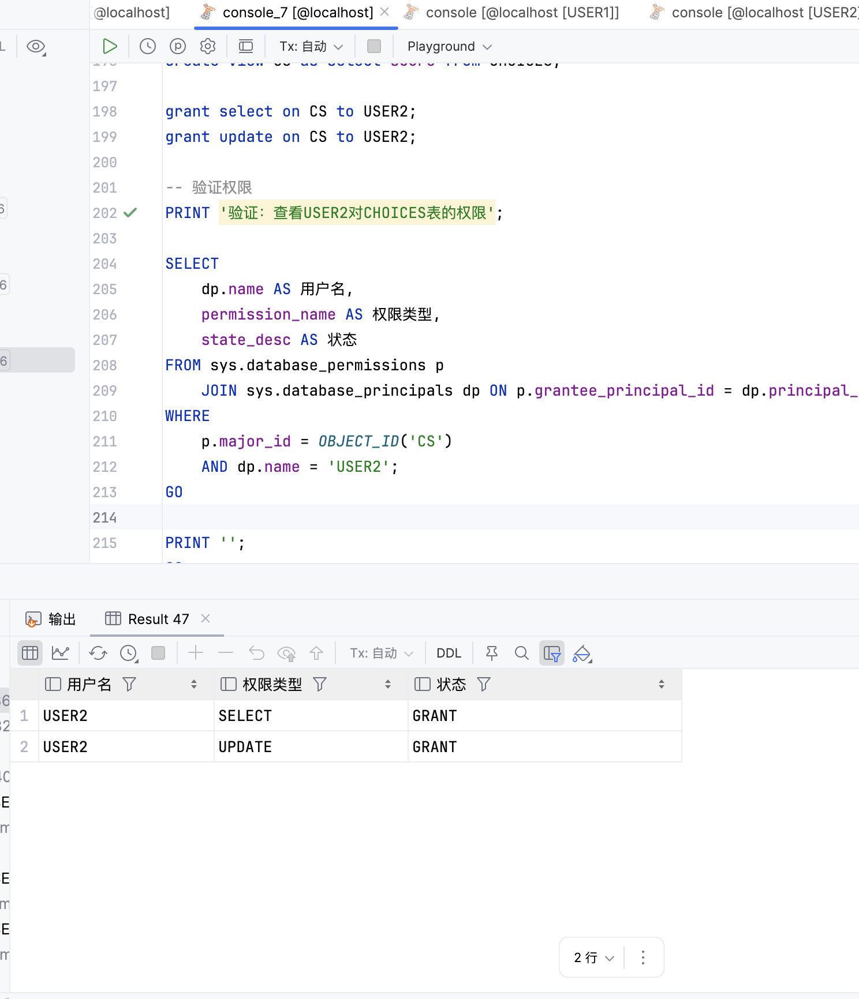

#### USER2测试权限
```sql
-- USER2执行
USE School_Data;
SELECT score FROM CHOICES;  -- 失败，无权限
SELECT * FROM CS;           -- 成功
```

**说明**：USER2没有WITH GRANT OPTION，因此不能将权限传播给其他用户。

### (5) 由USER1授予USER2对表TEACHERS的查询权限（带传播权）

由于USER1在题目(3)中获得了WITH GRANT OPTION，因此可以将权限传播给USER2：

```sql
-- USER1执行（在USER1的查询控制台）
GRANT SELECT ON TS TO USER2 WITH GRANT OPTION;
```

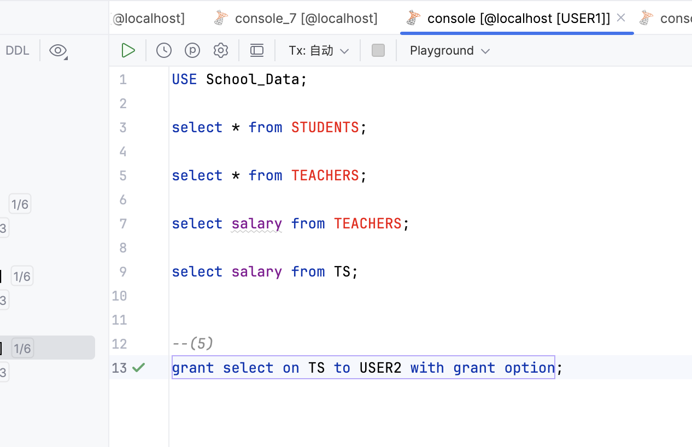

#### 验证权限
```sql
-- 管理员执行
SELECT dp.name AS 用户名, permission_name AS 权限类型, state_desc AS 状态,
       CASE WHEN p.state = 'W' THEN '是' ELSE '否' END AS 可传播
FROM sys.database_permissions p
JOIN sys.database_principals dp ON p.grantee_principal_id = dp.principal_id
WHERE p.major_id = OBJECT_ID('TS')
AND dp.name = 'USER2';
```

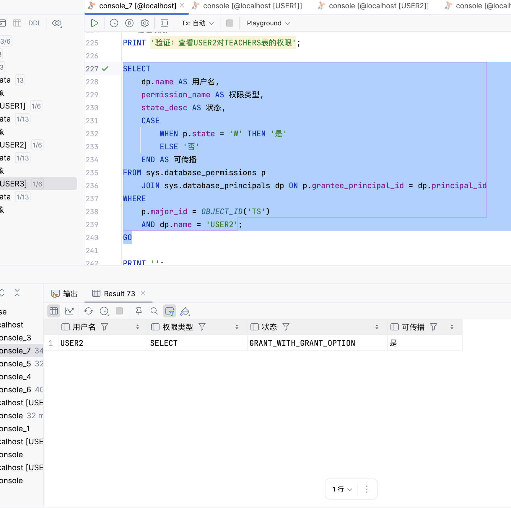

**说明**：USER1成功将权限传播给USER2，且USER2也获得了传播权。

### (6) 测试权限传播链（循环授权）

#### USER2授予USER3权限
```sql
-- USER2执行（在USER2的查询控制台）
GRANT SELECT ON TS TO USER3 WITH GRANT OPTION;
```

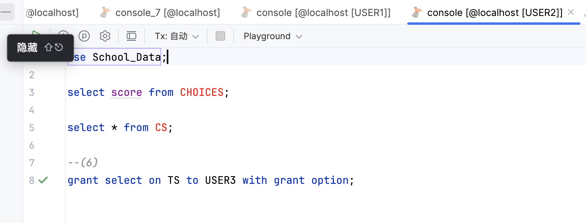

#### USER3授予USER2权限
```sql
-- USER3执行（在USER3的查询控制台）
GRANT SELECT ON TS TO USER2 WITH GRANT OPTION;
```

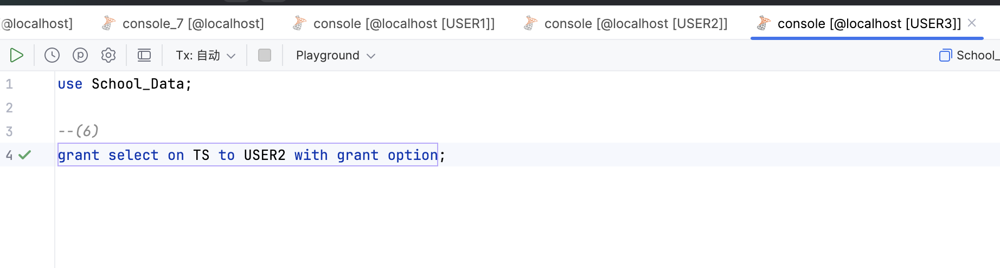

#### 验证权限状态
```sql
-- 管理员执行
SELECT dp.name AS 用户名, permission_name AS 权限类型, state_desc AS 状态,
       CASE WHEN p.state = 'W' THEN '是' ELSE '否' END AS 可传播
FROM sys.database_permissions p
JOIN sys.database_principals dp ON p.grantee_principal_id = dp.principal_id
WHERE p.major_id = OBJECT_ID('TS')
AND dp.name IN ('USER2', 'USER3');
```

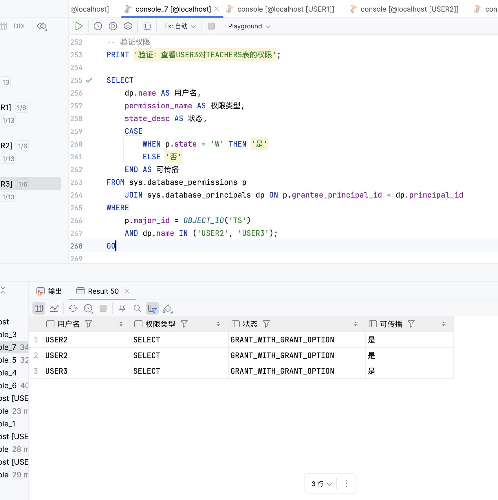

**讨论**：
- SQL Server允许循环授权，不会报错
- USER2和USER3互相授予权限后，都拥有对TS的查询权限和传播权
- 系统视图中出现了两条USER2的记录，这是因为USER2从两个不同的授权者（USER1和USER3）获得了权限
- 这种循环授权在逻辑上是允许的，但在权限管理上可能造成混乱

### (7) 取消USER1对表TEACHERS的查询权限，测试级联反应

#### 取消前查看权限
在题目(6)中，我们建立了复杂的权限传播链：
- 管理员授予USER1权限（带传播权）
- USER1授予USER2权限（带传播权）
- USER2授予USER3权限（带传播权）
- USER3又授予USER2权限（带传播权，形成循环）

```sql
-- 管理员执行
SELECT dp.name AS 用户名, permission_name AS 权限类型, state_desc AS 状态,
       CASE WHEN p.state = 'W' THEN '是' ELSE '否' END AS 可传播
FROM sys.database_permissions p
JOIN sys.database_principals dp ON p.grantee_principal_id = dp.principal_id
WHERE p.major_id = OBJECT_ID('TS')
AND dp.name IN ('USER1', 'USER2', 'USER3');
```

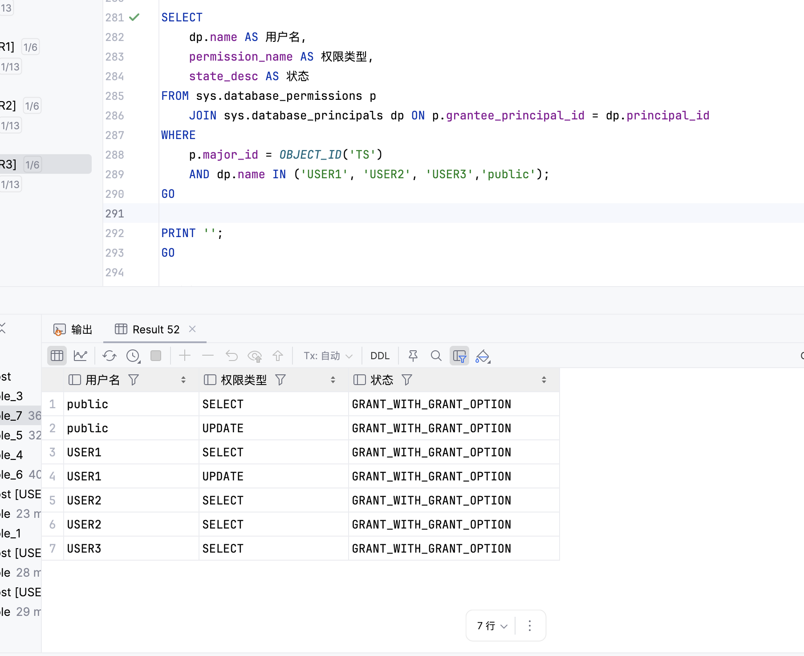

可以看到，取消前USER1、USER2、USER3都拥有对TS的查询权限，其中USER2有两条记录（分别来自USER1和USER3的授权）。

#### 执行取消操作
```sql
-- 管理员执行
REVOKE SELECT ON TS FROM USER1 CASCADE;
```

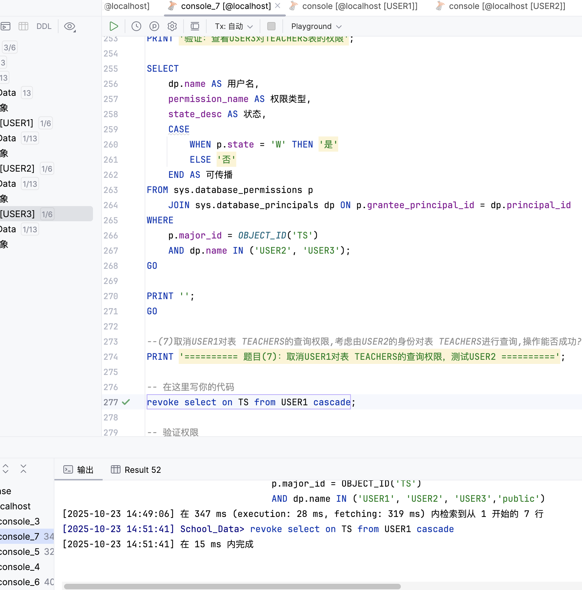

#### 取消后查看权限
```sql
SELECT dp.name AS 用户名, permission_name AS 权限类型, state_desc AS 状态
FROM sys.database_permissions p
JOIN sys.database_principals dp ON p.grantee_principal_id = dp.principal_id
WHERE p.major_id = OBJECT_ID('TS')
AND dp.name IN ('USER1', 'USER2', 'USER3');
```


可以看到，取消后所有用户的权限记录都消失了，包括USER3授予给USER2的权限也被级联撤销。

#### 验证用户无法访问
```sql
-- USER2执行
SELECT * FROM TS;  -- 失败，权限不足
```

```sql
-- USER3执行
SELECT * FROM TS;  -- 失败，权限不足
```

所有用户现在都无法查询TS视图。

**重要发现与讨论**：
1. **CASCADE的强大威力**：使用`REVOKE ... CASCADE`会级联撤销所有由该用户直接或间接传播出去的权限，即使存在循环授权也不例外。

2. **权限传播链的完全断裂**：权限传播链为：管理员→USER1→USER2→USER3→USER2（循环）。当撤销USER1的权限时，整个链条完全断裂，所有下游用户的权限都被撤销。

3. **循环授权也会被级联撤销**：虽然USER3授予了USER2权限（形成循环），但这个权限的根源仍然是管理员通过USER1传播的。一旦撤销USER1的权限，即使是循环授权的权限也会被级联撤销。这说明SQL Server能够追踪权限的授权来源，并在撤销时进行完整的依赖分析。

4. **防止孤儿权限**：CASCADE机制确保了权限的一致性，防止出现"孤儿权限"（即授权者已失去权限，但被授权者仍保留权限的情况）。这是数据库安全的重要保障。

5. **实际应用中的注意事项**：在生产环境中使用CASCADE撤销权限时必须特别小心，因为一次操作可能影响整个权限传播链上的所有用户，可能导致大量用户突然失去访问权限。建议在执行前先查询权限依赖关系，评估影响范围。

### (8) 取消USER1和USER2关于表COURSES的权限

#### 取消前查看权限
```sql
-- 管理员执行
SELECT dp.name AS 用户名, permission_name AS 权限类型, state_desc AS 状态
FROM sys.database_permissions p
JOIN sys.database_principals dp ON p.grantee_principal_id = dp.principal_id
WHERE p.major_id = OBJECT_ID('COURSES')
AND dp.name IN ('USER1', 'USER2', 'public');
```

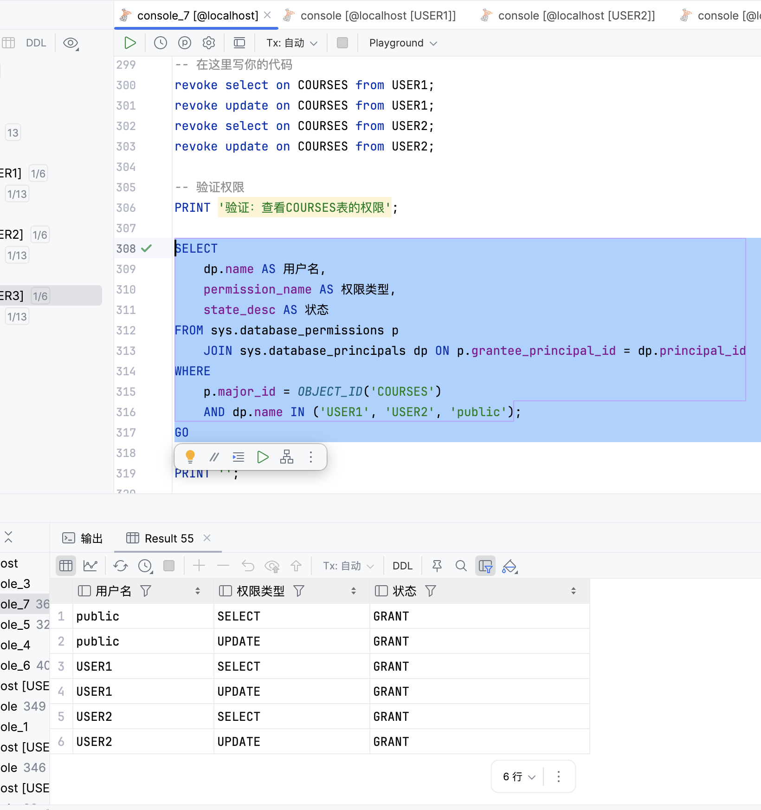

#### 执行取消操作
```sql
-- 管理员执行
REVOKE SELECT ON COURSES FROM USER1;
REVOKE UPDATE ON COURSES FROM USER1;
REVOKE SELECT ON COURSES FROM USER2;
REVOKE UPDATE ON COURSES FROM USER2;
```

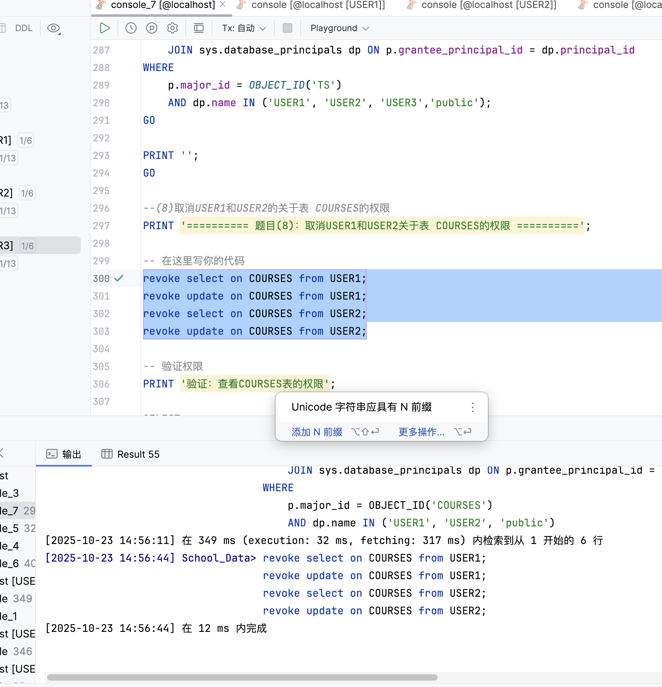

#### 取消后查看权限
```sql
SELECT dp.name AS 用户名, permission_name AS 权限类型, state_desc AS 状态
FROM sys.database_permissions p
JOIN sys.database_principals dp ON p.grantee_principal_id = dp.principal_id
WHERE p.major_id = OBJECT_ID('COURSES')
AND dp.name IN ('USER1', 'USER2', 'public');
```

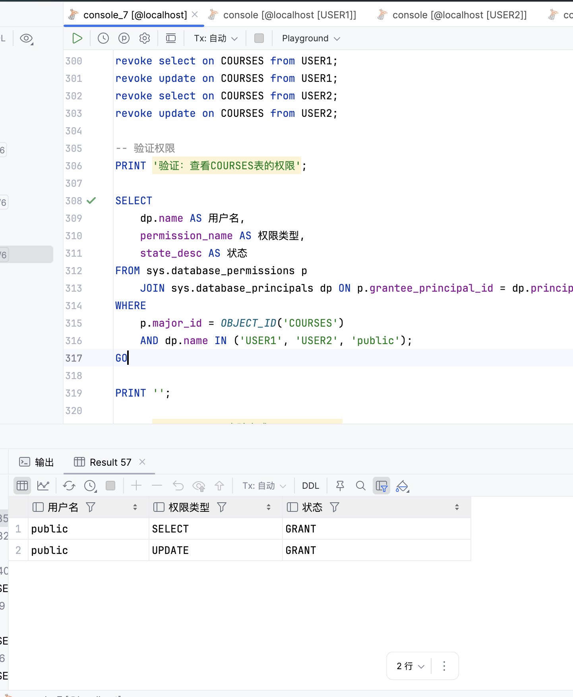

**说明**：由于USER1和USER2的权限来自PUBLIC，直接REVOKE USER1和USER2不会生效，因为他们仍然通过PUBLIC角色拥有权限。

#### 取消PUBLIC的权限
```sql
-- 管理员执行
REVOKE SELECT ON COURSES FROM PUBLIC;
REVOKE UPDATE ON COURSES FROM PUBLIC;
```

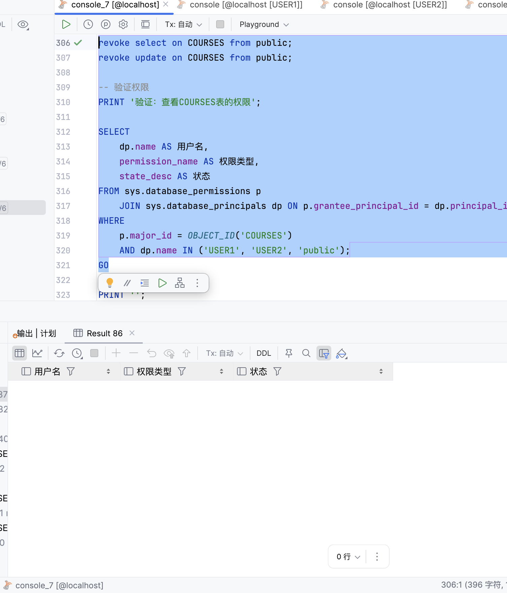

#### 验证USER1和USER2无法访问
```sql
-- USER1执行
SELECT * FROM COURSES;
```

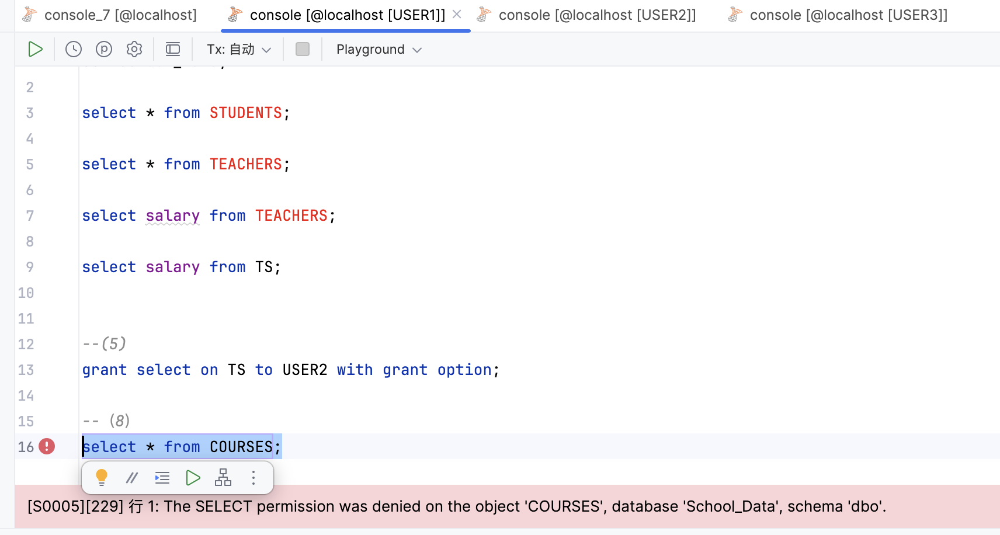

```sql
-- USER2执行
SELECT * FROM COURSES;
```

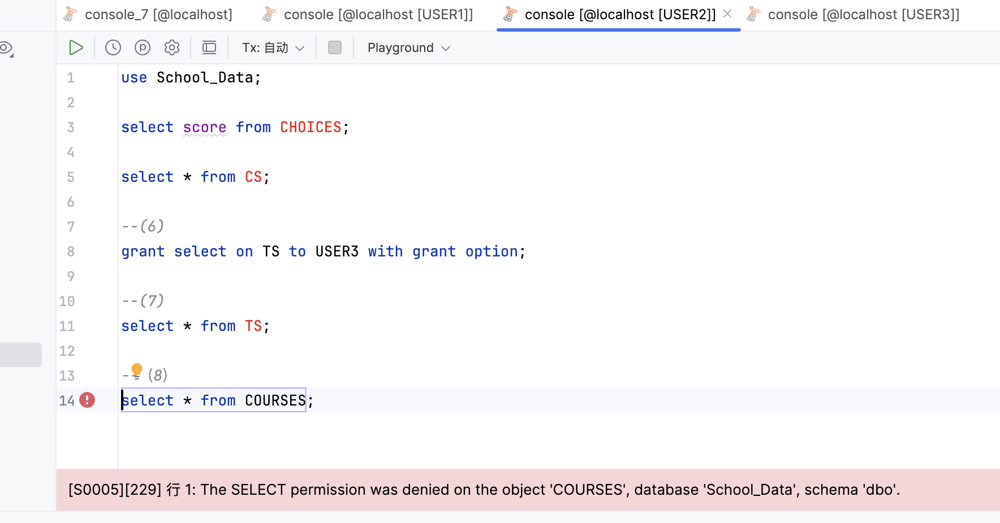

**说明**：
- 通过PUBLIC授予的权限需要从PUBLIC撤销才能完全取消
- 单独撤销某个用户的权限不会影响该用户通过PUBLIC获得的权限
- 撤销PUBLIC的权限后，所有用户（包括USER1、USER2、USER3）都无法访问COURSES表

## 四、问题&总结

通过本次实验，我深入理解了SQL Server的权限管理机制，包括授权、权限传播和权限撤销等核心概念。

**关于授权机制**：SQL Server提供了灵活的授权方式。使用PUBLIC关键字可以一次性授予所有用户权限，这在需要公开某些数据时非常方便。但PUBLIC授权也有风险，因为它会影响所有用户，包括未来创建的用户。对于需要精细控制的场景，应该针对特定用户或角色授权。

**关于列级权限控制**：SQL Server不直接支持列级GRANT语句，但可以通过创建视图来实现列级权限控制。在题目(3)和(4)中，我创建了TS和CS视图，分别只包含TEACHERS表的salary字段和CHOICES表的score字段，然后对视图授权。这样用户只能访问特定的列，而不能访问整个表。这种方法在实际应用中很有用，可以保护敏感数据。

**关于权限传播（WITH GRANT OPTION）**：WITH GRANT OPTION是一个强大但需要谨慎使用的特性。它允许被授权者将权限继续传播给其他用户，形成权限传播链。在题目(5)中，USER1将权限传播给USER2，USER2又传播给USER3。这种机制在分级管理中很有用，但也可能导致权限失控。

**关于循环授权**：题目(6)测试了一个有趣的场景：USER2授权给USER3，USER3又授权给USER2，形成循环。我发现SQL Server允许这种循环授权，不会报错。系统视图中甚至出现了两条USER2的记录，因为USER2从两个不同的授权者（USER1和USER3）获得了权限。这说明SQL Server的权限系统记录的是每一次授权操作，而不是简单的"有权限"或"无权限"的状态。虽然循环授权在技术上可行，但在权限管理上可能造成混乱，应该避免。

**关于权限撤销的级联效应**：题目(7)展示了REVOKE CASCADE的强大威力和精确的依赖追踪能力。当撤销USER1的权限时，所有由USER1直接或间接传播出去的权限都会被级联撤销。权限传播链是：管理员→USER1→USER2→USER3→USER2（循环），撤销USER1的权限会导致整个链条完全断裂。最令人印象深刻的是，即使USER3授予了USER2权限（形成循环授权），这个权限也会被级联撤销，因为SQL Server能够追踪到这个权限的根源仍然是通过USER1传播的。实验结果显示，撤销后USER1、USER2、USER3都完全失去了对TS的访问权限，没有任何"孤儿权限"残留。这个机制确保了权限的一致性和安全性，但在实际应用中需要特别小心，因为一次撤销操作可能影响整个权限传播链上的所有用户，造成大范围的访问中断。

**关于PUBLIC角色的特殊性**：题目(8)让我认识到PUBLIC角色的特殊性。在题目(2)中，我通过PUBLIC授予了所有用户对COURSES表的权限。在题目(8)中，当我尝试撤销USER1和USER2的权限时，发现单独撤销某个用户不起作用，因为他们仍然通过PUBLIC角色拥有权限。必须撤销PUBLIC的权限，才能真正取消所有用户的访问权限。这说明PUBLIC是一个特殊的角色，所有用户都自动属于PUBLIC，通过PUBLIC授予的权限需要从PUBLIC撤销。

**实验中的技术细节**：在实验过程中，我采用了在不同数据源创建查询控制台的方式来模拟多用户环境。这种方法比使用EXECUTE AS USER更直观，可以真实地测试不同用户的权限。每个用户都有独立的连接和会话，更接近实际的多用户场景。

**权限管理的最佳实践**：通过这次实验，我总结了一些权限管理的最佳实践：
1. 遵循最小权限原则，只授予必要的权限
2. 谨慎使用WITH GRANT OPTION，避免权限失控
3. 避免过度依赖PUBLIC角色，对敏感数据使用特定用户授权
4. 使用视图实现列级权限控制和行级权限控制
5. 定期审查权限，及时撤销不再需要的权限
6. 使用CASCADE撤销权限时要特别小心，因为会影响权限传播链上的所有用户

**系统视图的使用**：实验中大量使用了sys.database_permissions和sys.database_principals等系统视图来查看权限状态。这些视图提供了权限管理的透明度，可以清楚地看到谁拥有什么权限、权限是否可传播、权限的授予者是谁等信息。掌握这些系统视图的使用对于权限管理和故障排查非常重要。

总的来说，这次实验让我对数据库的安全机制有了更深入的理解。权限管理是数据库安全的核心，正确使用GRANT和REVOKE语句，合理设计权限结构，对于保护数据安全和维护系统稳定至关重要。
