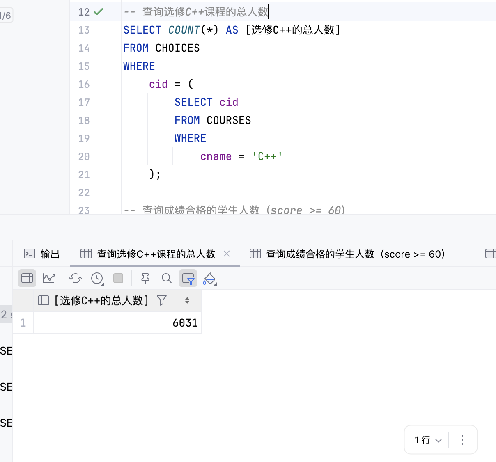
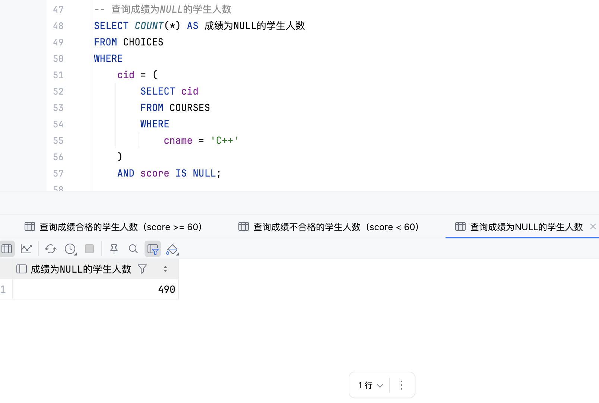
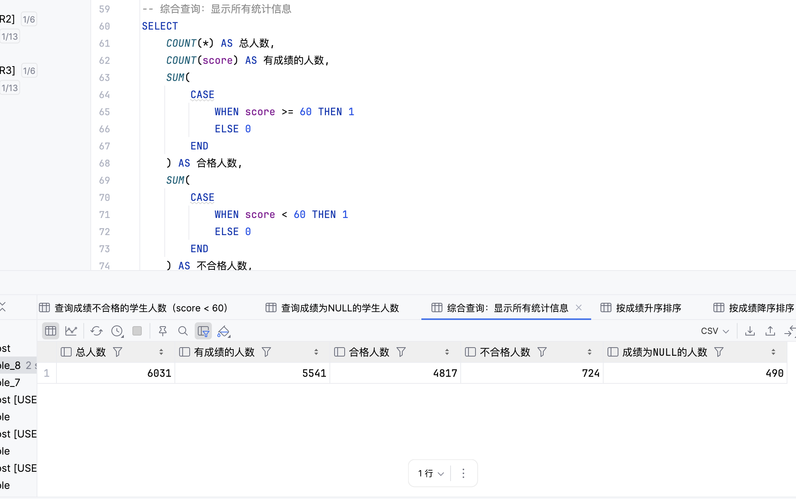
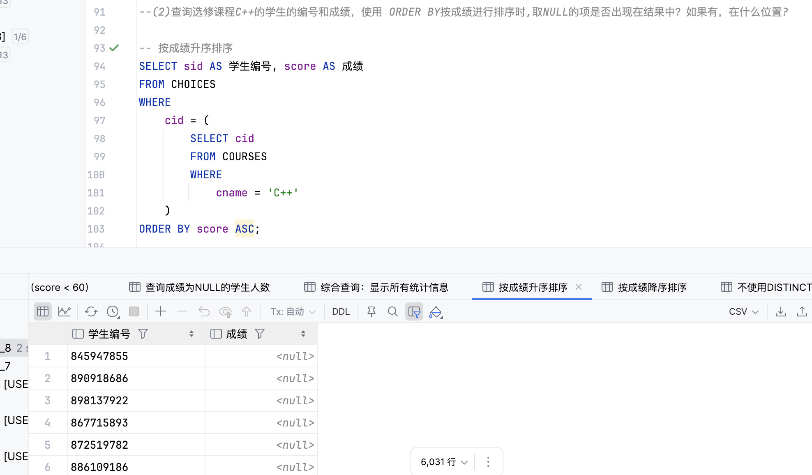
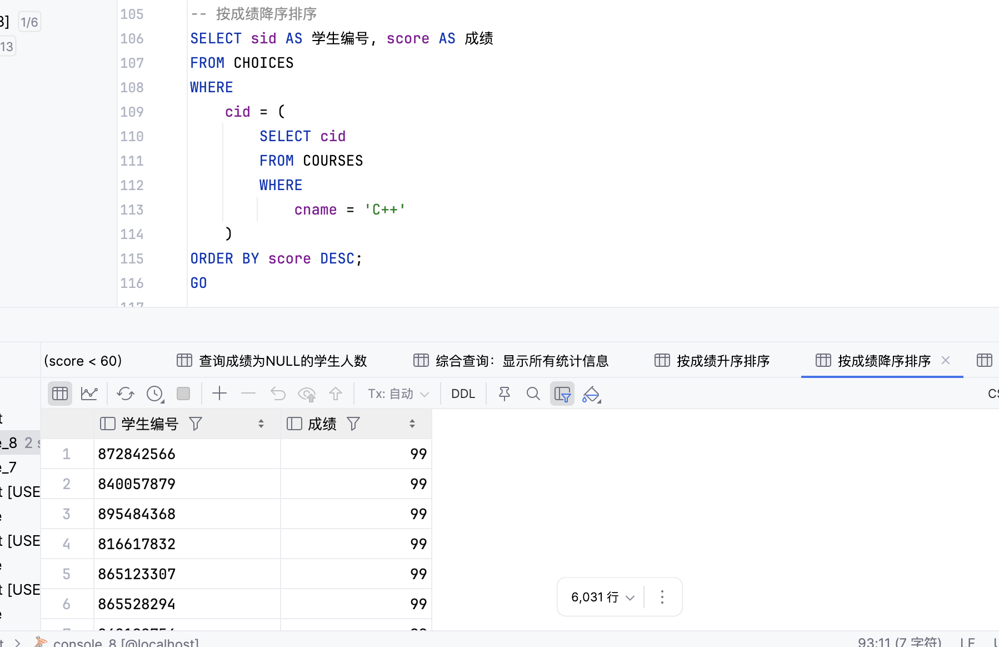
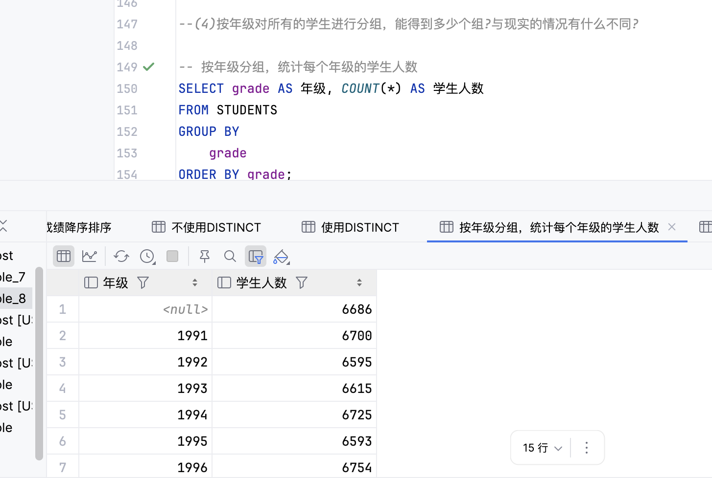
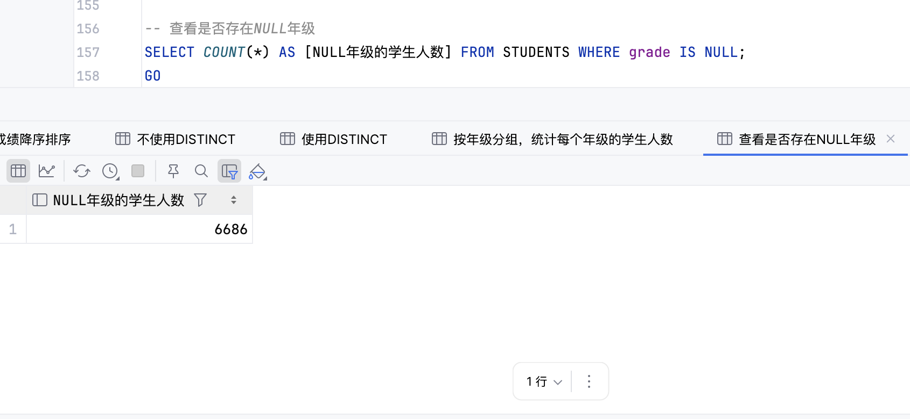
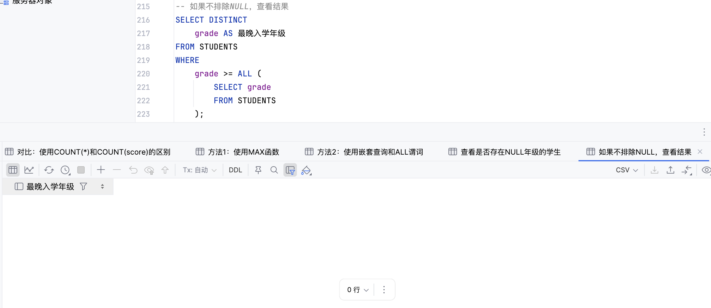

# 数据库实验报告（第八周）

班 级：3班   
姓 名：梁力航   
学 号：23336128

## 一、实验目的
- 熟悉SQL中空值（NULL）的处理方法
- 掌握分组查询和集合函数的使用
- 理解NULL值在查询、排序、分组和集合函数中的特殊行为

## 二、实验内容
1) 通过查询选修课程C++的学生的人数，其中成绩合格的学生人数，不合格的学生人数，讨论NULL值的特殊含义。
2) 查询选修课程C++的学生的编号和成绩，使用ORDER BY按成绩进行排序时，取NULL的项是否出现在结果中？如果有，在什么位置？
3) 在上面的查询的过程中，如果加上保留字DISTINCT会有什么效果呢？
4) 按年级对所有的学生进行分组，能得到多少个组？与现实的情况有什么不同？
5) 结合分组，使用集合函数求每个课程选修的学生的平均分，总的选课记录数，最高成绩，最低成绩，讨论考察取空值的项对集合函数的作用的影响。
6) 采用嵌套查询的方式，利用比较运算符和谓词ALL的结合来查询表STUDENTS中最晚入学的学生年级。当存在GRADE取空值的项时，考虑可能出现的情况，并解释。

> 说明：本实验在SQL Server环境下进行，使用School_Data数据库。

## 三、实验结果

### (1) 查询选修C++课程的学生人数，讨论NULL值的特殊含义

#### 查询选修C++课程的总人数
```sql
SELECT COUNT(*) AS [选修C++的总人数]
FROM CHOICES
WHERE cid = (SELECT cid FROM COURSES WHERE cname = 'C++');
```



#### 查询成绩合格的学生人数（score >= 60）
```sql
SELECT COUNT(*) AS 成绩合格的学生人数
FROM CHOICES
WHERE cid = (SELECT cid FROM COURSES WHERE cname = 'C++')
AND score >= 60;
```


#### 查询成绩不合格的学生人数（score < 60）
```sql
SELECT COUNT(*) AS 成绩不合格的学生人数
FROM CHOICES
WHERE cid = (SELECT cid FROM COURSES WHERE cname = 'C++')
AND score < 60;
```


#### 查询成绩为NULL的学生人数
```sql
SELECT COUNT(*) AS 成绩为NULL的学生人数
FROM CHOICES
WHERE cid = (SELECT cid FROM COURSES WHERE cname = 'C++')
AND score IS NULL;
```



#### 综合查询：显示所有统计信息
```sql
SELECT
    COUNT(*) AS 总人数,
    COUNT(score) AS 有成绩的人数,
    SUM(CASE WHEN score >= 60 THEN 1 ELSE 0 END) AS 合格人数,
    SUM(CASE WHEN score < 60 THEN 1 ELSE 0 END) AS 不合格人数,
    SUM(CASE WHEN score IS NULL THEN 1 ELSE 0 END) AS 成绩为NULL的人数
FROM CHOICES
WHERE cid = (SELECT cid FROM COURSES WHERE cname = 'C++');
```



**关于NULL值的特殊含义讨论**：

1. **NULL不参与比较运算**：在WHERE条件中，`score >= 60`和`score < 60`都不会匹配NULL值。NULL表示"未知"或"不适用"，不能与任何值进行大小比较。

2. **总人数 ≠ 合格人数 + 不合格人数**：从结果可以看出，选修C++的总人数等于合格人数、不合格人数和成绩为NULL的人数之和。这说明NULL值是一个独立的状态，不属于合格也不属于不合格。

3. **COUNT(*)与COUNT(列名)的区别**：
   - `COUNT(*)`统计所有行，包括NULL值
   - `COUNT(score)`只统计score不为NULL的行
   - 两者的差值就是NULL值的数量

4. **NULL的实际意义**：在选课系统中，成绩为NULL可能表示：
   - 学生已选课但尚未参加考试
   - 学生缺考
   - 成绩尚未录入系统
   - 其他特殊情况

### (2) 使用ORDER BY排序时NULL值的位置

#### 按成绩升序排序
```sql
SELECT sid AS 学生编号, score AS 成绩
FROM CHOICES
WHERE cid = (SELECT cid FROM COURSES WHERE cname = 'C++')
ORDER BY score ASC;
```



#### 按成绩降序排序
```sql
SELECT sid AS 学生编号, score AS 成绩
FROM CHOICES
WHERE cid = (SELECT cid FROM COURSES WHERE cname = 'C++')
ORDER BY score DESC;
```



**关于NULL值在排序中的位置**：

1. **NULL值会出现在结果中**：ORDER BY不会过滤掉NULL值，所有记录都会出现在结果集中。

2. **SQL Server中NULL值的排序规则**：
   - 在升序排序（ASC）时，NULL值出现在最前面
   - 在降序排序（DESC）时，NULL值也出现在最前面
   - SQL Server将NULL视为"最小值"

3. **不同数据库的差异**：不同数据库系统对NULL的排序处理可能不同：
   - SQL Server和MySQL：NULL排在最前面
   - Oracle：可以使用NULLS FIRST或NULLS LAST控制NULL的位置
   - PostgreSQL：默认NULL排在最后，但可以指定

### (3) DISTINCT关键字对NULL值的影响

#### 不使用DISTINCT
```sql
SELECT sid AS 学生编号, score AS 成绩
FROM CHOICES
WHERE cid = (SELECT cid FROM COURSES WHERE cname = 'C++')
ORDER BY score ASC;
```

%20不使用DISTINCT.png)

#### 使用DISTINCT
```sql
SELECT DISTINCT sid AS 学生编号, score AS 成绩
FROM CHOICES
WHERE cid = (SELECT cid FROM COURSES WHERE cname = 'C++')
ORDER BY score ASC;
```

使用DISTINCT.png)

**DISTINCT对NULL值的处理**：

1. **DISTINCT去除的是整行重复**：DISTINCT是对SELECT的所有列进行去重，只有当(sid, score)这个组合完全相同时才会被去重。

2. **多个NULL值的情况**：
   - 从结果可以看到，使用DISTINCT后仍然有很多NULL值
   - 这是因为这些NULL对应的是**不同的学生**（sid不同）
   - 例如：(800554079, NULL)和(800575453, NULL)是两条不同的记录
   - 虽然score都是NULL，但sid不同，所以不会被去重

3. **NULL在DISTINCT中的规则**：
   - 在DISTINCT操作中，多个NULL被认为是"相同的"
   - 但这个"相同"是针对单个列而言的
   - 当SELECT多个列时，只有所有列都相同（包括都是NULL）才算重复
   - (sid1, NULL)和(sid2, NULL)不是重复行，因为sid不同

4. **实际效果**：
   - 不使用DISTINCT：6031行（所有选课记录）
   - 使用DISTINCT：6024行（去除了7条完全重复的记录）
   - 差异很小，说明CHOICES表中几乎没有完全重复的(sid, score)组合
   - NULL值仍然大量存在，因为它们对应不同的学生

5. **关键理解**：DISTINCT不是"去除所有NULL"，而是"去除重复行"。只要sid不同，即使score都是NULL，这些行也不会被去重。

### (4) 按年级分组统计

#### 按年级分组，统计每个年级的学生人数
```sql
SELECT grade AS 年级, COUNT(*) AS 学生人数
FROM STUDENTS
GROUP BY grade
ORDER BY grade;
```



#### 查看是否存在NULL年级
```sql
SELECT COUNT(*) AS [NULL年级的学生人数]
FROM STUDENTS
WHERE grade IS NULL;
```



**分组中NULL值的处理**：

1. **NULL值会形成单独的一组**：如果存在grade为NULL的学生，GROUP BY会将所有NULL值归为一组。

2. **与现实情况的差异**：
   - 理论上：每个学生都应该有明确的入学年级
   - 实际数据：可能存在年级信息缺失的情况（数据录入错误、转学生信息不全等）
   - NULL组的存在：反映了数据质量问题，需要在实际应用中处理

3. **分组数量**：
   - 如果没有NULL：分组数 = 不同年级的数量
   - 如果有NULL：分组数 = 不同年级的数量 + 1（NULL组）

4. **数据完整性建议**：
   - 应该对grade字段添加NOT NULL约束
   - 或者设置默认值
   - 定期检查和清理NULL数据

### (5) 集合函数对NULL值的处理

#### 按课程分组，统计各项指标
```sql
SELECT
    c.cname AS 课程名称,
    COUNT(*) AS 选课记录数,
    COUNT(ch.score) AS 有成绩的记录数,
    AVG(ch.score) AS 平均分,
    MAX(ch.score) AS 最高成绩,
    MIN(ch.score) AS 最低成绩,
    SUM(CASE WHEN ch.score IS NULL THEN 1 ELSE 0 END) AS 成绩为NULL的记录数
FROM CHOICES ch
JOIN COURSES c ON ch.cid = c.cid
GROUP BY c.cname
ORDER BY c.cname;
```

按课程分组，统计各项指标.png)

#### 对比：使用COUNT(*)和COUNT(score)的区别
```sql
SELECT
    c.cname AS 课程名称,
    COUNT(*) AS [COUNT星号],
    COUNT(ch.score) AS COUNT_score,
    COUNT(*) - COUNT(ch.score) AS [差值即NULL数量]
FROM CHOICES ch
JOIN COURSES c ON ch.cid = c.cid
GROUP BY c.cname
ORDER BY c.cname;
```

和COUNT(score)的区别.png)

**集合函数对NULL值的处理规则**：

1. **COUNT函数**：
   - `COUNT(*)`：统计所有行，包括NULL
   - `COUNT(列名)`：只统计该列非NULL的行
   - 差值可以用来计算NULL的数量

2. **AVG函数**：
   - 只计算非NULL值的平均值
   - NULL值被完全忽略，不参与计算
   - 例如：(80 + 90 + NULL) / 2 = 85，而不是 170 / 3

3. **MAX和MIN函数**：
   - 只考虑非NULL值
   - 返回非NULL值中的最大值和最小值
   - 如果所有值都是NULL，则返回NULL

4. **SUM函数**：
   - 只对非NULL值求和
   - NULL值被忽略
   - 如果所有值都是NULL，则返回NULL

5. **实际影响**：
   - 平均分的计算：NULL值不会拉低平均分，因为它们不参与计算
   - 统计准确性：需要区分"没有数据"（COUNT=0）和"有数据但为NULL"
   - 业务逻辑：在计算平均分、及格率等指标时，需要明确NULL值的处理策略

### (6) 使用ALL谓词查询最晚入学年级

#### 方法1：使用MAX函数
```sql
SELECT MAX(grade) AS 最晚入学年级
FROM STUDENTS;
```

MAX函数.png)

#### 方法2：使用嵌套查询和ALL谓词（排除NULL）
```sql
SELECT DISTINCT grade AS 最晚入学年级
FROM STUDENTS
WHERE grade >= ALL (
    SELECT grade
    FROM STUDENTS
    WHERE grade IS NOT NULL
);
```

方法2：使用嵌套查询和ALL谓词.png)

#### 查看是否存在NULL年级的学生
```sql
SELECT sid, sname, grade
FROM STUDENTS
WHERE grade IS NULL;
```

查看是否存在NULL年级的学生.png)

#### 如果不排除NULL，查看结果
```sql
SELECT DISTINCT grade AS 最晚入学年级
FROM STUDENTS
WHERE grade >= ALL (
    SELECT grade
    FROM STUDENTS
);
```



**ALL谓词与NULL值的关系**：

1. **MAX函数自动忽略NULL**：
   - MAX(grade)会自动忽略NULL值
   - 返回所有非NULL值中的最大值
   - 这是最简单可靠的方法

2. **ALL谓词的逻辑**：
   - `grade >= ALL (子查询)`表示grade大于或等于子查询返回的所有值
   - 如果子查询包含NULL，则比较结果为UNKNOWN
   - UNKNOWN在WHERE条件中被视为FALSE

3. **包含NULL时的问题**：
   - 如果子查询返回的结果集包含NULL
   - 任何值与NULL比较都返回UNKNOWN
   - `grade >= ALL (包含NULL的集合)`永远不会为TRUE
   - 结果集为空

4. **正确的做法**：
   - 在子查询中使用`WHERE grade IS NOT NULL`排除NULL值
   - 或者使用MAX函数，它会自动处理NULL

5. **实验结果分析**：
   - 排除NULL：能正确返回最晚入学年级
   - 不排除NULL：返回空结果集（0行）
   - 这说明数据中确实存在grade为NULL的记录

## 四、问题&总结

通过本次实验，我深入理解了SQL中NULL值的特殊性质及其在各种操作中的行为。NULL值的处理是数据库编程中的重要课题，需要特别注意。

**关于NULL的本质**：NULL不是一个值，而是一个标记，表示"未知"、"不适用"或"缺失"。这个概念在关系数据库理论中被称为"三值逻辑"（TRUE、FALSE、UNKNOWN）。理解这一点是正确处理NULL的基础。在实验(1)中，我发现成绩为NULL的学生既不算合格也不算不合格，这完美体现了NULL的"未知"特性。

**关于NULL的比较运算**：NULL不能用普通的比较运算符（=、<、>等）进行比较。任何值与NULL的比较结果都是UNKNOWN，在WHERE条件中被视为FALSE。这就是为什么`score >= 60`和`score < 60`都不会匹配NULL值。要判断某个值是否为NULL，必须使用`IS NULL`或`IS NOT NULL`。这个规则在实验(1)中得到了充分验证，合格人数加不合格人数并不等于总人数，差值就是NULL的数量。

**关于NULL的排序行为**：实验(2)让我了解到，在SQL Server中，NULL值在排序时被视为"最小值"，无论升序还是降序，NULL都会出现在结果集的最前面。这个行为在不同数据库系统中可能不同，Oracle允许使用NULLS FIRST或NULLS LAST来控制NULL的位置。在实际应用中，如果NULL值的位置很重要，可能需要使用CASE表达式来自定义排序规则。

**关于NULL的去重和分组**：实验(3)和(4)展示了一个有趣的矛盾：虽然NULL != NULL（在比较运算中），但在DISTINCT和GROUP BY操作中，多个NULL被视为相同值。这是SQL标准的规定，目的是让这些操作能够正常工作。如果NULL在分组时也被视为不同，那么每个NULL都会形成单独的一组，这显然不合理。在实验(4)中，如果存在grade为NULL的学生，它们会被归为一个组，这个组在结果中显示为NULL。

**关于集合函数对NULL的处理**：实验(5)是本次实验的重点，揭示了不同集合函数对NULL的处理策略。COUNT(*)统计所有行，而COUNT(列名)只统计非NULL行，这个差异非常重要。AVG、SUM、MAX、MIN等函数都会忽略NULL值，只对非NULL值进行计算。这意味着如果一个学生的成绩是NULL，它不会拉低班级平均分，因为它根本不参与计算。这个行为在某些场景下是合理的（比如学生缺考不应该算0分），但在其他场景下可能需要特殊处理（比如需要将NULL视为0）。

**关于ALL谓词与NULL的陷阱**：实验(6)展示了一个经典的NULL陷阱。当使用`grade >= ALL (子查询)`时，如果子查询结果包含NULL，整个条件永远不会为TRUE，导致返回空结果集。这是因为`grade >= NULL`返回UNKNOWN，而`grade >= ALL (包含NULL的集合)`要求grade大于等于所有值，包括NULL，这是不可能满足的。解决方法是在子查询中使用`WHERE grade IS NOT NULL`排除NULL，或者直接使用MAX函数，因为MAX会自动忽略NULL。

**数据质量与NULL值**：通过这次实验，我认识到NULL值的存在往往反映了数据质量问题。在实验(4)中，如果发现有学生的年级为NULL，这可能是数据录入错误、系统迁移问题或业务流程缺陷。在实际应用中，应该通过以下方式减少NULL值：
1. 在表设计时合理使用NOT NULL约束
2. 为可能为空的字段设置合理的默认值
3. 在应用层进行数据验证
4. 定期检查和清理NULL数据

**NULL值的业务含义**：不同字段的NULL值可能有不同的业务含义。在选课系统中，成绩为NULL可能表示"尚未考试"，这是正常的业务状态；但年级为NULL则可能是数据错误。在编写SQL时，需要根据具体的业务场景来决定如何处理NULL值。有时需要将NULL转换为特定值（使用COALESCE或ISNULL函数），有时需要将NULL视为特殊状态单独处理。

**COUNT函数的两种形式**：实验中反复使用了COUNT(*)和COUNT(列名)的对比，这两者的区别非常重要。COUNT(*)统计行数，COUNT(列名)统计该列非NULL的值的数量。在实际应用中，如果要统计"有多少学生选了这门课"，应该用COUNT(*)；如果要统计"有多少学生有成绩"，应该用COUNT(score)。两者的差值就是成绩为NULL的学生数量。

**三值逻辑的实践**：SQL的WHERE条件使用三值逻辑：TRUE、FALSE、UNKNOWN。只有TRUE的行才会被选中。这就是为什么`score >= 60`不会匹配NULL值，因为`NULL >= 60`返回UNKNOWN。在编写复杂条件时，需要特别注意NULL值的影响。例如，`NOT (score < 60)`并不等价于`score >= 60`，因为前者对NULL返回UNKNOWN，后者也返回UNKNOWN，但`score >= 60 OR score IS NULL`才能包含NULL值。

**实用技巧总结**：
1. 使用`IS NULL`和`IS NOT NULL`判断NULL，不要使用`= NULL`
2. 使用`COALESCE(列名, 默认值)`将NULL转换为特定值
3. 使用`COUNT(*) - COUNT(列名)`计算NULL的数量
4. 在使用ALL、ANY等谓词时，注意排除NULL值
5. 理解集合函数自动忽略NULL的行为
6. 在ORDER BY中考虑NULL的排序位置
7. 在GROUP BY中注意NULL会形成单独的一组

总的来说，NULL值是SQL中一个复杂但重要的概念。正确理解和处理NULL值，对于编写健壮的SQL查询和保证数据质量都至关重要。这次实验通过多个角度展示了NULL值的行为特点，为今后的数据库开发打下了坚实的基础。

