# 数据库实验报告（第三周）

班 级：3班   
姓 名：梁力航   
学 号：23336128

## 一、实验目的
- 熟悉SQL的数据查询语言，
- 能够使用SQL语句对数据库进行单表查询、 连接查询

## 二、实验内容
1) 查询全部课程的详细记录，并按课程编号升序
2) 查询所有有选修课的学生编号及姓名
3) 查询课时 < 88 的课程编号
4) 找出总分超过 400 分的学生
5) 统计课程总数
6) 查询所有课程及其被选修的学生总数
7) 查询选修成绩 > 60 的课程数量超过 2 门的学生编号及最低分
8) 统计每个学生的选修课程数目与平均成绩
9) 查询选修 Java 的所有学生的编号及姓名
10) 查询姓名为 sssht 的学生所选课程的编号和成绩
11) 查询课时比课程 C++ 多的课程名称

> 说明：所有查询均在 `USE School_Data;` 上下文下执行。

## 三、实验结果

### (1) 查询全部课程的详细记录
```sql
USE School_Data;
SELECT DISTINCT *
FROM COURSES
ORDER BY cid;
```

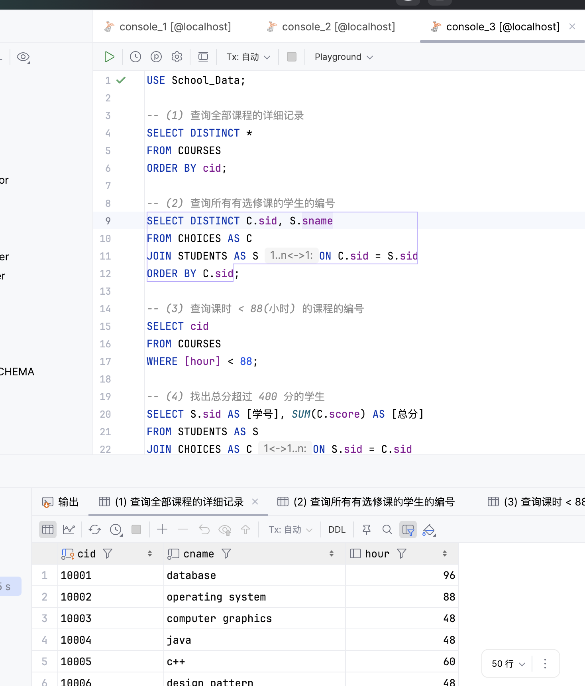

### (2) 查询所有有选修课的学生的编号
```sql
SELECT DISTINCT C.sid, S.sname
FROM CHOICES AS C
JOIN STUDENTS AS S ON C.sid = S.sid
ORDER BY C.sid;
```

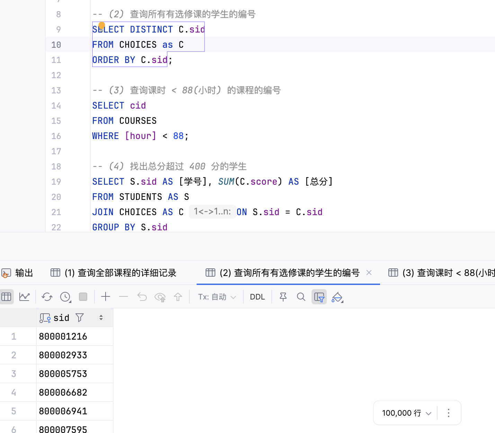

### (3) 查询课时 < 88 的课程的编号
```sql
SELECT cid
FROM COURSES
WHERE [hour] < 88;
```

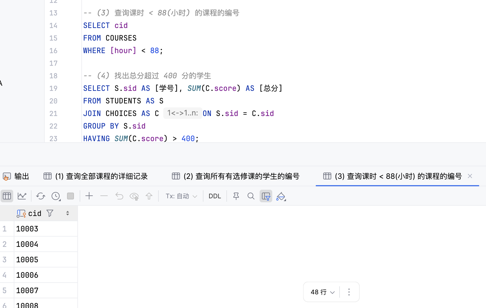

### (4) 找出总分超过 400 分的学生
```sql
SELECT S.sid AS [学号], SUM(C.score) AS [总分]
FROM STUDENTS AS S
JOIN CHOICES AS C ON S.sid = C.sid
GROUP BY S.sid
HAVING SUM(C.score) > 400;
```

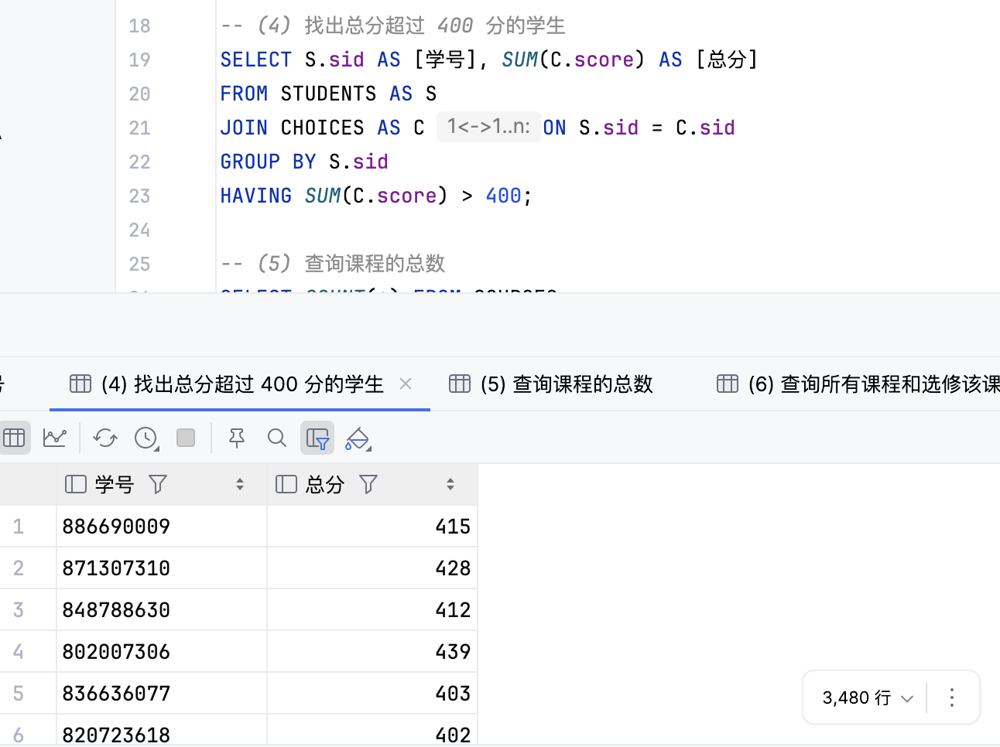

### (5) 查询课程的总数
```sql
SELECT COUNT(*) AS [课程总数]
FROM COURSES;
```

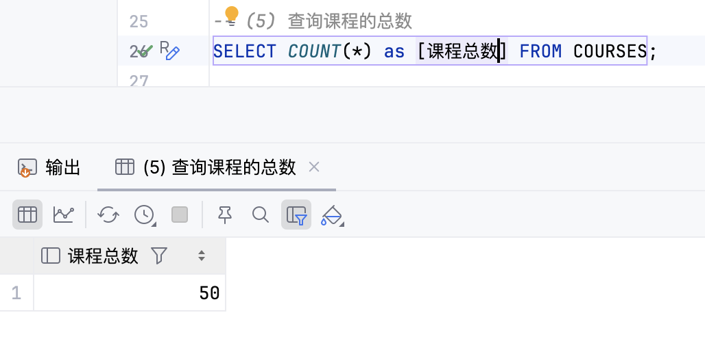

### (6) 查询所有课程和选修该课程的学生总数
```sql
SELECT C.cid, COUNT(CH.sid) AS [number of students]
FROM COURSES AS C
LEFT JOIN CHOICES AS CH ON CH.cid = C.cid
GROUP BY C.cid;
```

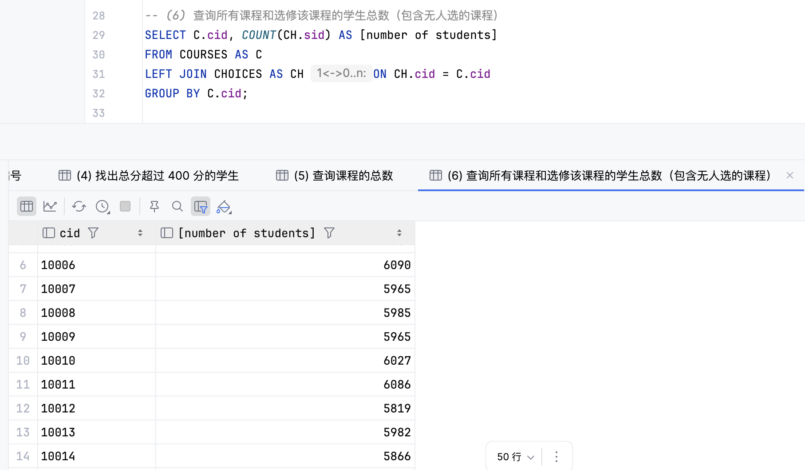

### (7) 查询选修成绩超过 60 的课程超过两门的学生编号
#### 未考虑重修
SELECT X.sid,COUNT( X.cid) AS [课程数]
FROM CHOICES AS X
WHERE X.score > 60
GROUP BY X.sid
HAVING COUNT( X.cid) > 2;
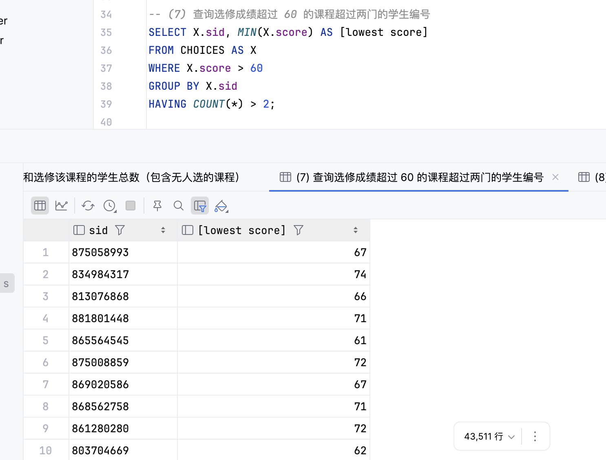

#### 考虑重修
```sql
SELECT X.sid,COUNT(distinct X.cid) AS [课程数]
FROM CHOICES AS X
WHERE X.score > 60
GROUP BY X.sid
HAVING COUNT(distinct X.cid) > 2;
```

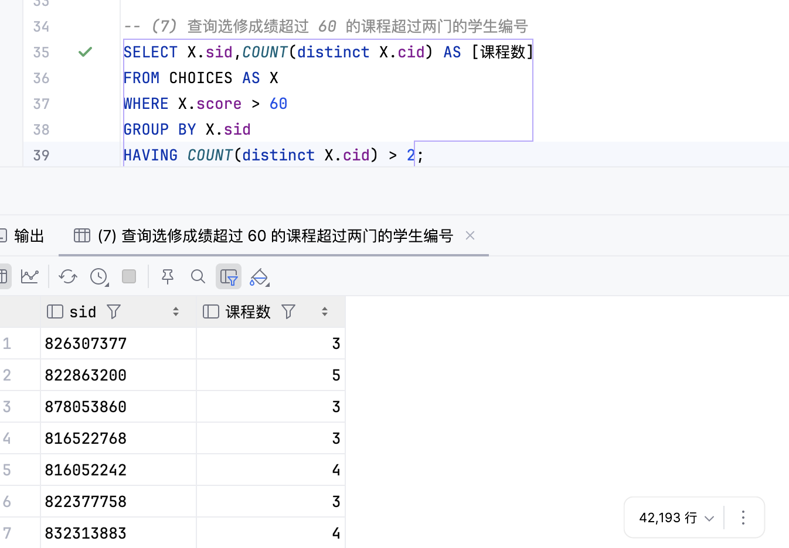

### (8) 统计各个学生的选修课程数目和平均成绩
```sql
SELECT CH.sid AS [学号],
       COUNT(*)      AS [选修课程数目],
       AVG(CH.score) AS [平均成绩]
FROM CHOICES AS CH
GROUP BY CH.sid;
```

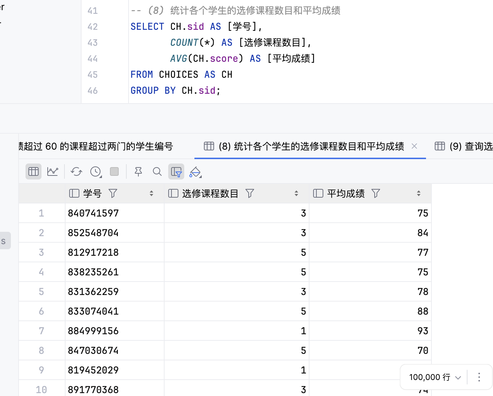

### (9) 查询选修 Java 的所有学生的编号及姓名
```sql
SELECT C.sid AS [学号], S.sname AS [姓名]
FROM CHOICES AS C
JOIN STUDENTS AS S ON C.sid = S.sid
JOIN COURSES  AS K ON C.cid = K.cid
WHERE K.cname = 'java';
```

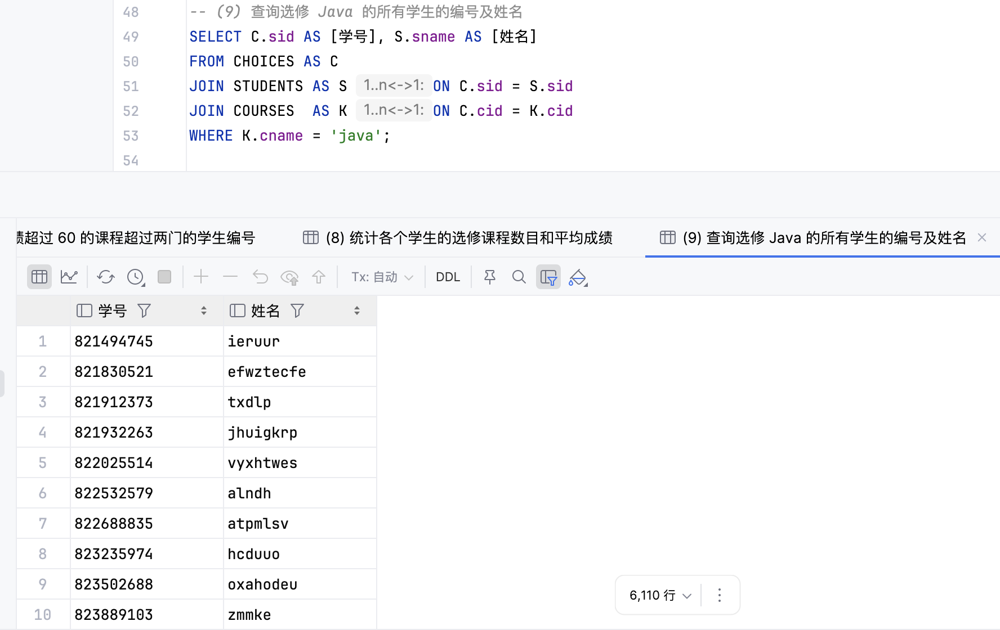

### (10) 查询姓名为 sssht 的学生所选的课程的编号和成绩
```sql
SELECT C.cid AS [课程编号], C.score AS [成绩]
FROM CHOICES AS C
JOIN STUDENTS AS S ON C.sid = S.sid
WHERE S.sname = 'sssht';
```

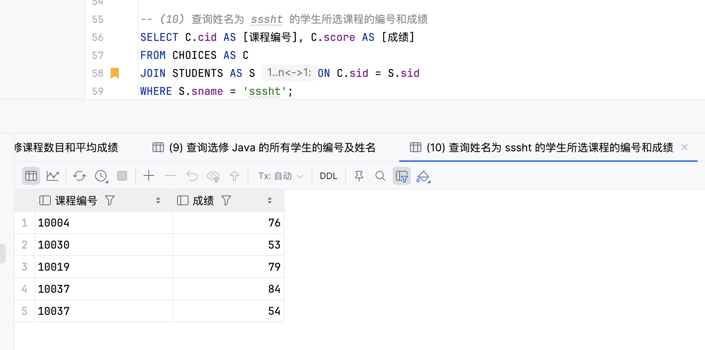

### (11) 查询其他课时比课程 C++ 多的课程的名称
```sql
SELECT X.cname
FROM COURSES AS X
JOIN COURSES AS Y ON Y.cname = 'C++'
WHERE X.cname <> 'C++' AND X.[hour] > Y.[hour];
```

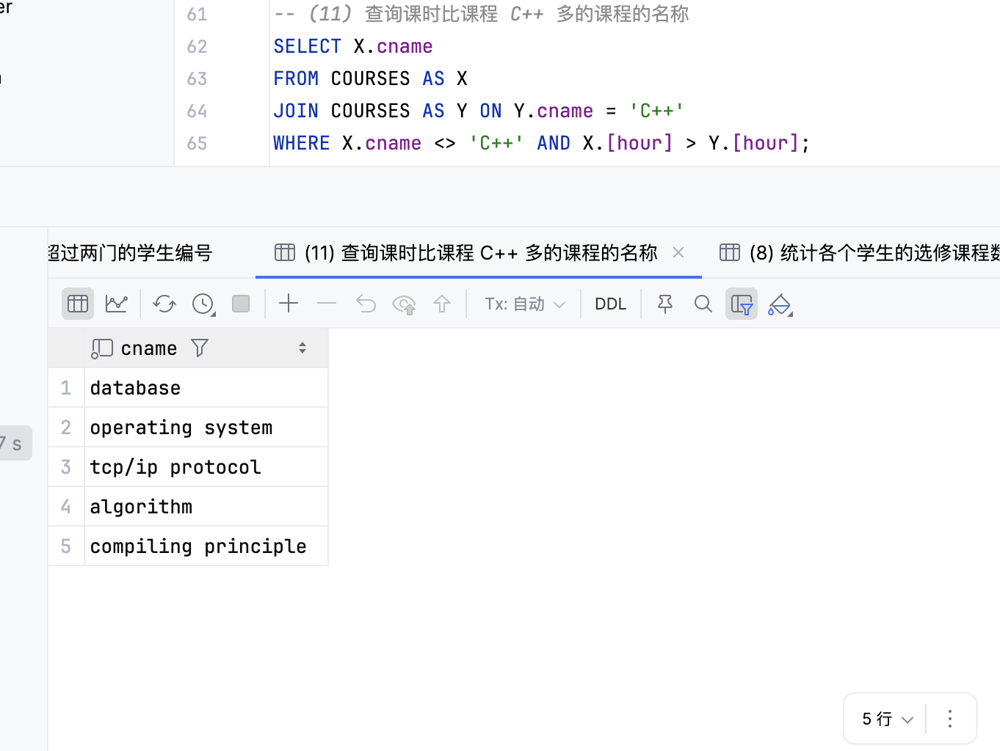

## 四、问题&总结
  - 第(6)题：一开始用的是内连接join，但是“没人选”的课程就没考虑到了。把它换成 LEFT JOIN，这样就能把所有课程都数进来了。
  - 第(3)题：列名叫 hour，容易和时间相关的关键词撞车。给它加上方括号 `[hour]`更清楚。
  - 别名写法：原先用单引号当别名，查询后发现SQL Server 里不太推荐。统一改成方括号，比如 `[学号]`、`[总分]`，更清晰也更规范。
  - DISTINCT：第(6)题已经 GROUP BY 了，再写 DISTINCT 就重复了，所以把 DISTINCT 去掉，语句更干净。
  - 连接风格：第(9)(10)(11) 原来用逗号把表连起来，不太直观。改成显式 JOIN，逻辑一眼就能看懂，也更不容易踩坑。

