# 数据库实验报告（第二周）

班 级：3班   						   
姓 名：梁力航      	              
学 号：23336128

## 一、实验目的
熟悉SQL的数据定义语言，
能够熟练地使用SQL语句来创建和更改基本表,创建和取消索引。 

## 二、实验内容
使用 CREATE语句创建基本表
更改基本表的定义，增加列，删除列，修改列的数据类型
创建表的升降序索引
取消表、表的索引或表的约束 


## 三、实验结果
### (1) 创建数据库表（CUSTOMERS / AGENTS / PRODUCTS）
要求：CID、AID、PID 为各表主键；AGENTS.[PERCENT] < 100

SQL 语句：
```sql
-- 任务(1)：创建基础表
CREATE TABLE CUSTOMERS (
    CID INT PRIMARY KEY,
    CNAME NVARCHAR(50) NOT NULL,
    CITY NVARCHAR(50),
    DISCNT DECIMAL(5,2)
);

CREATE TABLE AGENTS (
    AID INT PRIMARY KEY,
    ANAME NVARCHAR(50) NOT NULL,
    CITY NVARCHAR(50),
    [PERCENT] DECIMAL(5,2) CHECK ([PERCENT] < 100)
);

CREATE TABLE PRODUCTS (
    PID INT PRIMARY KEY,
    PNAME NVARCHAR(100) NOT NULL
);
```

### (2) 创建数据库表 ORDERS（含外键）
要求：ORDNA 为主键；CID/AID/PID 分别外键指向 CUSTOMERS/AGENTS/PRODUCTS
```sql
CREATE TABLE ORDERS (
    ORDNA INT PRIMARY KEY,
    MONTH NVARCHAR(10),
    CID INT NOT NULL,
    AID INT NOT NULL,
    PID INT NOT NULL,
    QTY INT,
    DOLLARS DECIMAL(10,2),
    CONSTRAINT FK_ORDERS_CUSTOMERS FOREIGN KEY (CID) REFERENCES CUSTOMERS(CID),
    CONSTRAINT FK_ORDERS_AGENTS FOREIGN KEY (AID) REFERENCES AGENTS(AID),
    CONSTRAINT FK_ORDERS_PRODUCTS FOREIGN KEY (PID) REFERENCES PRODUCTS(PID)
);
```

结果截图：

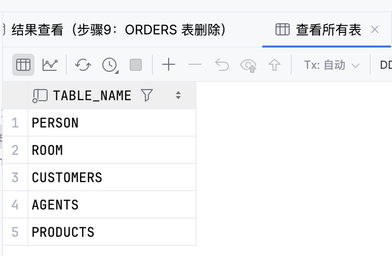
查看所有表
```sql
SELECT name AS TableName
FROM sys.tables
WHERE name IN ('CUSTOMERS','AGENTS','PRODUCTS','ORDERS')
ORDER BY name;
```

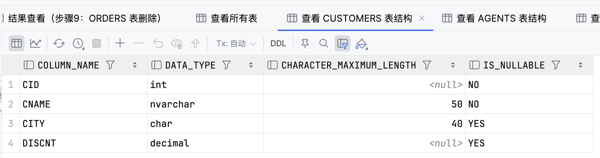
查看CUSTOMERS表结构
```sql
SELECT COLUMN_NAME, DATA_TYPE, CHARACTER_MAXIMUM_LENGTH, IS_NULLABLE
FROM INFORMATION_SCHEMA.COLUMNS 
WHERE TABLE_NAME = 'CUSTOMERS';
```

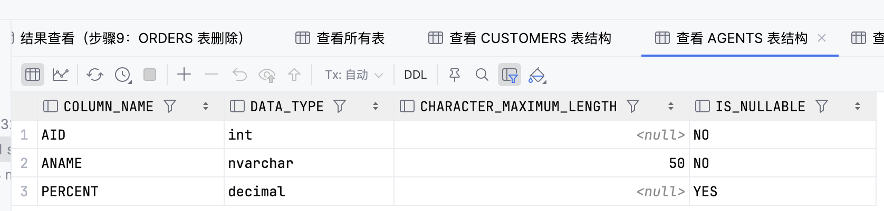
查看AGENT表结构
```sql
SELECT COLUMN_NAME, DATA_TYPE, CHARACTER_MAXIMUM_LENGTH, IS_NULLABLE
FROM INFORMATION_SCHEMA.COLUMNS 
WHERE TABLE_NAME = 'AGENTS';
```

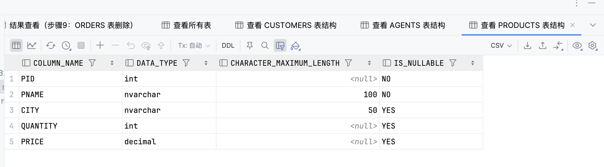
查看PRODUCTS表结构
```sql
SELECT COLUMN_NAME, DATA_TYPE, CHARACTER_MAXIMUM_LENGTH, IS_NULLABLE
FROM INFORMATION_SCHEMA.COLUMNS 
WHERE TABLE_NAME = 'PRODUCTS';
```

SQL 语句：
```sql
-- 结果查看（任务1-2）
SELECT name AS TableName
FROM sys.tables
WHERE name IN ('CUSTOMERS','AGENTS','PRODUCTS','ORDERS')
ORDER BY name;

SELECT fk.name AS FK_Name,
       OBJECT_NAME(fk.parent_object_id) AS ParentTable,
       OBJECT_NAME(fk.referenced_object_id) AS ReferencedTable
FROM sys.foreign_keys fk
WHERE fk.parent_object_id = OBJECT_ID('ORDERS');
```

结果截图：

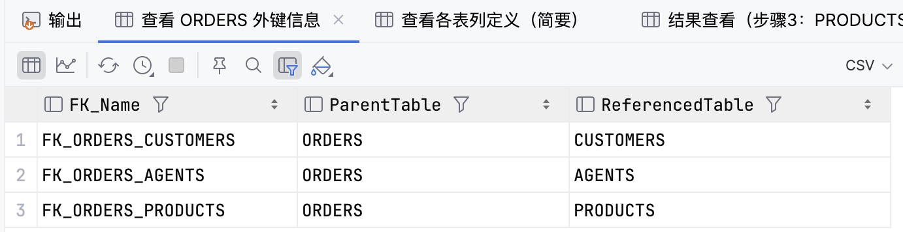
ORDERS外键信息
```sql
SELECT fk.name AS FK_Name,
       OBJECT_NAME(fk.parent_object_id) AS ParentTable,
       OBJECT_NAME(fk.referenced_object_id) AS ReferencedTable
FROM sys.foreign_keys fk
WHERE fk.parent_object_id = OBJECT_ID('ORDERS');
```

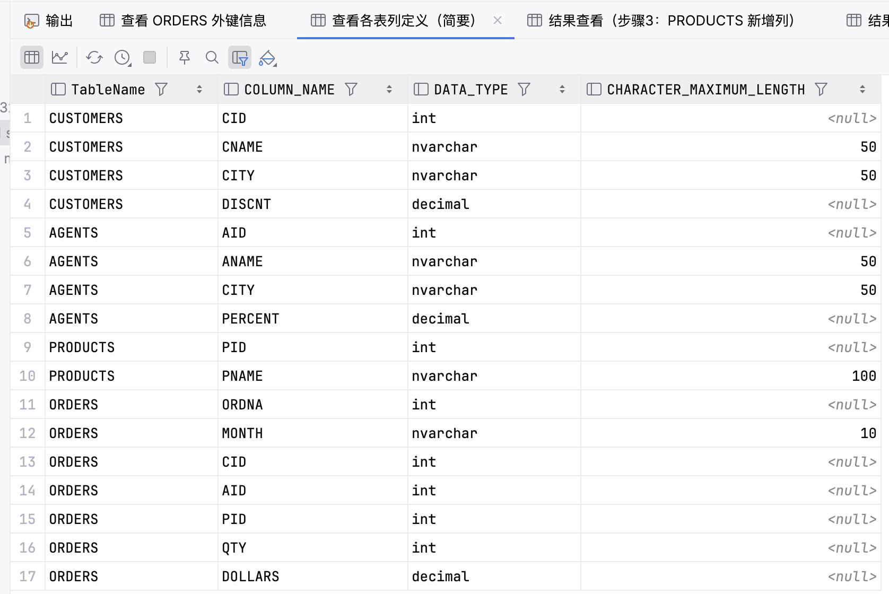
查看各表列定义
```sql
SELECT 'CUSTOMERS' AS TableName, COLUMN_NAME, DATA_TYPE, CHARACTER_MAXIMUM_LENGTH
FROM INFORMATION_SCHEMA.COLUMNS WHERE TABLE_NAME = 'CUSTOMERS'
UNION ALL
SELECT 'AGENTS', COLUMN_NAME, DATA_TYPE, CHARACTER_MAXIMUM_LENGTH
FROM INFORMATION_SCHEMA.COLUMNS WHERE TABLE_NAME = 'AGENTS'
UNION ALL
SELECT 'PRODUCTS', COLUMN_NAME, DATA_TYPE, CHARACTER_MAXIMUM_LENGTH
FROM INFORMATION_SCHEMA.COLUMNS WHERE TABLE_NAME = 'PRODUCTS'
UNION ALL
SELECT 'ORDERS', COLUMN_NAME, DATA_TYPE, CHARACTER_MAXIMUM_LENGTH
FROM INFORMATION_SCHEMA.COLUMNS WHERE TABLE_NAME = 'ORDERS';
```

### (3) 为 PRODUCTS 增加列（CITY, QUANTITY, PRICE）

SQL 语句：
```sql
-- 任务(3)：为 PRODUCTS 增加列
ALTER TABLE PRODUCTS 
ADD CITY NVARCHAR(50), 
    QUANTITY INT, 
    PRICE DECIMAL(10,2);
```

结果截图：

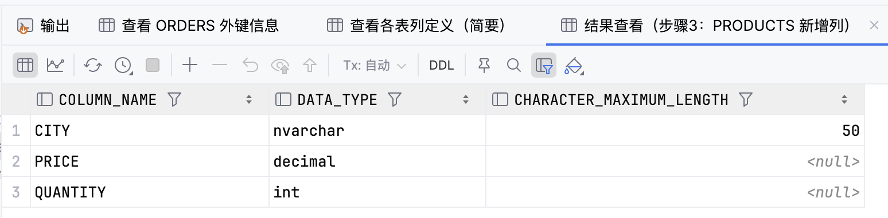
步骤3结果查看
```sql
SELECT COLUMN_NAME, DATA_TYPE, CHARACTER_MAXIMUM_LENGTH
FROM INFORMATION_SCHEMA.COLUMNS
WHERE TABLE_NAME = 'PRODUCTS' AND COLUMN_NAME IN ('CITY','QUANTITY','PRICE')
ORDER BY COLUMN_NAME;
```

### (4) 为四表建立按主键升序的非聚集索引

SQL 语句：
```sql
-- 任务(4)：为四表创建主键非聚集索引（升序）
CREATE UNIQUE NONCLUSTERED INDEX IDX_CUSTOMERS_CID ON CUSTOMERS (CID ASC);
CREATE UNIQUE NONCLUSTERED INDEX IDX_AGENTS_AID   ON AGENTS    (AID ASC);
CREATE UNIQUE NONCLUSTERED INDEX IDX_PRODUCTS_PID ON PRODUCTS  (PID ASC);
CREATE UNIQUE NONCLUSTERED INDEX IDX_ORDERS_ORDNA ON ORDERS    (ORDNA ASC);
```

结果截图：

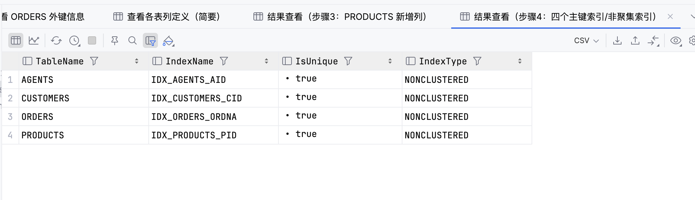
步骤4结果查看
```sql
SELECT OBJECT_NAME(i.object_id) AS TableName,
       i.name AS IndexName,
       i.is_unique AS IsUnique,
       i.type_desc AS IndexType
FROM sys.indexes i
WHERE i.name IN ('IDX_CUSTOMERS_CID','IDX_AGENTS_AID','IDX_PRODUCTS_PID','IDX_ORDERS_ORDNA')
ORDER BY TableName, IndexName;
```

### (5) 取消步骤(4)建立的 4 个索引

SQL 语句：
```sql
-- 任务(5)：删除步骤(4)创建的索引（存在性判断）
IF EXISTS (SELECT * FROM sys.indexes WHERE name='IDX_CUSTOMERS_CID' AND object_id=OBJECT_ID('CUSTOMERS'))
    DROP INDEX IDX_CUSTOMERS_CID ON CUSTOMERS;
IF EXISTS (SELECT * FROM sys.indexes WHERE name='IDX_AGENTS_AID'   AND object_id=OBJECT_ID('AGENTS'))
    DROP INDEX IDX_AGENTS_AID   ON AGENTS;
IF EXISTS (SELECT * FROM sys.indexes WHERE name='IDX_PRODUCTS_PID' AND object_id=OBJECT_ID('PRODUCTS'))
    DROP INDEX IDX_PRODUCTS_PID ON PRODUCTS;
IF EXISTS (SELECT * FROM sys.indexes WHERE name='IDX_ORDERS_ORDNA' AND object_id=OBJECT_ID('ORDERS'))
    DROP INDEX IDX_ORDERS_ORDNA ON ORDERS;
```

结果截图：

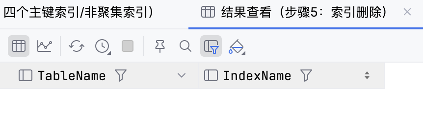
步骤5结果查看
```sql
SELECT OBJECT_NAME(i.object_id) AS TableName,
       i.name AS IndexName
FROM sys.indexes i
WHERE i.name IN ('IDX_CUSTOMERS_CID','IDX_AGENTS_AID','IDX_PRODUCTS_PID','IDX_ORDERS_ORDNA');
```

### (6) 创建 CUSTOMERS 的 CNAME 降序唯一索引

SQL 语句：
```sql
-- 任务(6)：CUSTOMERS 上创建 CNAME 降序唯一索引
IF EXISTS (SELECT * FROM sys.indexes WHERE name='IDX_CUSTOMERS_CNAME_DESC' AND object_id=OBJECT_ID('CUSTOMERS'))
    DROP INDEX IDX_CUSTOMERS_CNAME_DESC ON CUSTOMERS;
CREATE UNIQUE NONCLUSTERED INDEX IDX_CUSTOMERS_CNAME_DESC
ON CUSTOMERS (CNAME DESC);
```

结果截图：

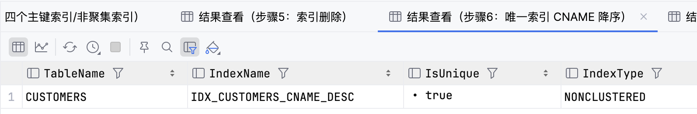
步骤6结果查看
```sql
SELECT OBJECT_NAME(i.object_id) AS TableName,
       i.name AS IndexName,
       i.is_unique AS IsUnique,
       i.type_desc AS IndexType
FROM sys.indexes i
WHERE i.name = 'IDX_CUSTOMERS_CNAME_DESC';
```

### (7) 删除 AGENTS.CITY 列

SQL 语句：
```sql
-- 任务(7)：删除 AGENTS.CITY 列
ALTER TABLE AGENTS DROP COLUMN CITY;
```

结果截图：

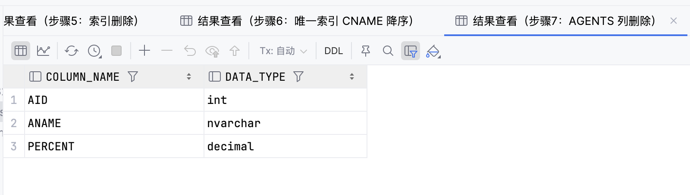
步骤7结果查看
```sql
SELECT COLUMN_NAME, DATA_TYPE
FROM INFORMATION_SCHEMA.COLUMNS
WHERE TABLE_NAME = 'AGENTS';
```

### (8) 修改 CUSTOMERS.CITY 为 CHAR(40)

SQL 语句：
```sql
-- 任务(8)：修改 CUSTOMERS.CITY 类型
ALTER TABLE CUSTOMERS 
ALTER COLUMN CITY CHAR(40);
```

结果截图：

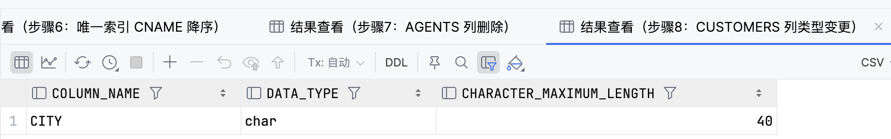
步骤8结果查看
```sql
SELECT COLUMN_NAME, DATA_TYPE, CHARACTER_MAXIMUM_LENGTH
FROM INFORMATION_SCHEMA.COLUMNS
WHERE TABLE_NAME = 'CUSTOMERS' AND COLUMN_NAME = 'CITY';
```

### (9) 删除表 ORDERS

SQL 语句：
```sql
-- 任务(9)：删除 ORDERS 表
DROP TABLE ORDERS;
```

结果截图：

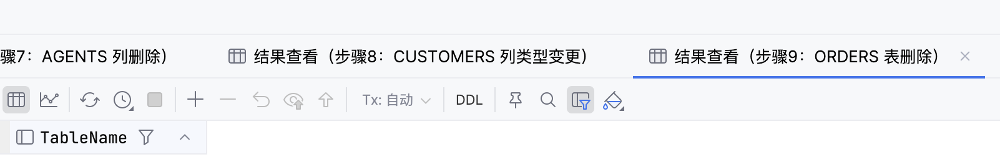
步骤9结果查看
```sql
SELECT name AS TableName
FROM sys.tables
WHERE name = 'ORDERS';
```

## 四、问题&总结
